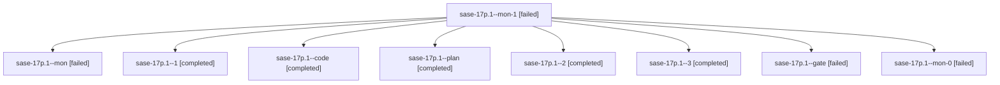

# Family: sase-17p.1

[Agent Hoods](../README.md) / [bbugyi200](../users/bbugyi200/README.md) / [athena](../users/bbugyi200/machines/athena/README.md) / [sase-17p](../users/bbugyi200/machines/athena/hoods/sase-17p/README.md) / sase-17p.1

Owner: `bbugyi200.athena` · Hood: `sase-17p` · Members: 9 · Bead: [sase-17p.1](https://github.com/sase-org/sase--beads/blob/main/pages/sase-17p/sase-17p.1.md)

## Lineage

The diagram is an optional enhancement; the ordered table below contains the same lineage in accessible text.

| Role | Agent | State | Model / provider | Timing | Commits | Prompt | Chat |
|---|---|---|---|---|---:|---|---|
| mon-1 | sase-17p.1--mon-1 | failed | muse-spark-1.3-contributor / muse | 2026-09-24T14:29:10.708370+00:00 → 2026-09-24T14:35:40.717525+00:00 | 0 | — | [Chat](../agents/bbugyi200.athena.sase-17p.1--mon-1/chat.md) |
| mon | sase-17p.1--mon | failed | muse-spark-1.3-contributor / muse | 2026-09-24T13:33:24.607994+00:00 → 2026-09-24T13:52:15.824105+00:00 | 0 | — | [Chat](../agents/bbugyi200.athena.sase-17p.1--mon/chat.md) |
| 1 | sase-17p.1--1 | completed | muse-spark-1.3-contributor / muse | 2026-09-24T13:56:08.944127+00:00 → 2026-09-24T14:10:40.642737+00:00 | 0 | [Prompt](../agents/bbugyi200.athena.sase-17p.1--1/prompt.md) | [Chat](../agents/bbugyi200.athena.sase-17p.1--1/chat.md) |
| code | sase-17p.1--code | completed | muse-spark-1.3-contributor / muse | 2026-09-24T12:51:54.552044+00:00 → 2026-09-24T13:34:27.913658+00:00 | 0 | — | [Chat](../agents/bbugyi200.athena.sase-17p.1--code/chat.md) |
| plan | sase-17p.1--plan | completed | opus / claude | 2026-09-24T12:42:21.994533+00:00 → 2026-09-24T13:34:27.913658+00:00 | 0 | [Prompt](../agents/bbugyi200.athena.sase-17p.1--plan/prompt.md) | [Chat](../agents/bbugyi200.athena.sase-17p.1--plan/chat.md) |
| 2 | sase-17p.1--2 | completed | muse-spark-1.3-contributor / muse | 2026-09-24T14:14:10.557481+00:00 → 2026-09-24T14:32:35.719164+00:00 | 0 | [Prompt](../agents/bbugyi200.athena.sase-17p.1--2/prompt.md) | [Chat](../agents/bbugyi200.athena.sase-17p.1--2/chat.md) |
| 3 | sase-17p.1--3 | completed | muse-spark-1.3-contributor / muse | 2026-09-24T14:35:40.332446+00:00 → 2026-09-24T14:48:32.592919+00:00 | [1](../agents/bbugyi200.athena.sase-17p.1--3/README.md#commits) | [Prompt](../agents/bbugyi200.athena.sase-17p.1--3/prompt.md) | [Chat](../agents/bbugyi200.athena.sase-17p.1--3/chat.md) |
| gate | sase-17p.1--gate | failed | opus / claude | 2026-09-24T12:51:13.240339+00:00 → 2026-09-24T12:51:33.113493+00:00 | 0 | — | [Chat](../agents/bbugyi200.athena.sase-17p.1--gate/chat.md) |
| mon-0 | sase-17p.1--mon-0 | failed | muse-spark-1.3-contributor / muse | 2026-09-24T14:09:34.491346+00:00 → 2026-09-24T14:13:59.616660+00:00 | 0 | — | [Chat](../agents/bbugyi200.athena.sase-17p.1--mon-0/chat.md) |

## Commits

| Role | Repo | Commit | Subject | Committed |
|---|---|---|---|---|
| 3 | sase | [`b6b9f4f`](https://github.com/sase-org/sase/commit/b6b9f4f59b900f74edbcd0bbea2f704c2659a128) | feat(tool): add hand-off adapters, contract probes, and finish diagnostics | 2026-09-24 10:44:13 EDT |

## Neighbors

| Agent | Relation | State |
|---|---|---|
| [sase-17p.2](../agents/bbugyi200.athena.sase-17p.2/README.md) | sase-17p hood | waiting |
| [sase-17p.3](../agents/bbugyi200.athena.sase-17p.3/README.md) | sase-17p hood | waiting |
| [sase-17p.4](../agents/bbugyi200.athena.sase-17p.4/README.md) | sase-17p hood | waiting |
| [sase-17p.5](../agents/bbugyi200.athena.sase-17p.5/README.md) | sase-17p hood | waiting |
| [sase-17p.6](../agents/bbugyi200.athena.sase-17p.6/README.md) | sase-17p hood | waiting |
| [sase-17p.land](../agents/bbugyi200.athena.sase-17p.land/README.md) | sase-17p hood | waiting |
