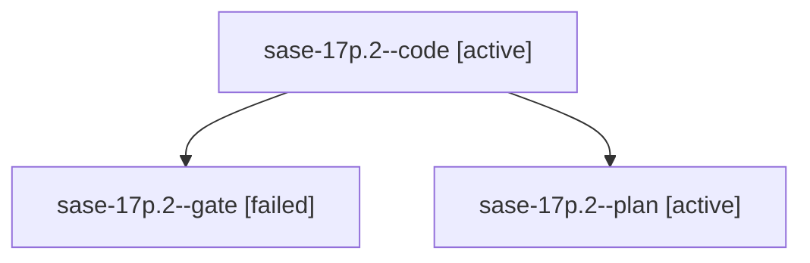

# Family: sase-17p.2

[Agent Hoods](../README.md) / [bbugyi200](../users/bbugyi200/README.md) / [athena](../users/bbugyi200/machines/athena/README.md) / [sase-17p](../users/bbugyi200/machines/athena/hoods/sase-17p/README.md) / sase-17p.2

Owner: `bbugyi200.athena` · Hood: `sase-17p` · Members: 3 · Bead: [sase-17p.2](https://github.com/sase-org/sase--beads/blob/main/pages/sase-17p/sase-17p.2.md)

## Lineage

The diagram is an optional enhancement; the ordered table below contains the same lineage in accessible text.

| Role | Agent | State | Model / provider | Timing | Commits | Prompt | Chat |
|---|---|---|---|---|---:|---|---|
| code | sase-17p.2--code | active | muse-spark-1.3-contributor / muse | 2026-09-24T15:18:43.679227+00:00 | 0 | — | — |
| gate | sase-17p.2--gate | failed | opus / claude | 2026-09-24T15:17:09.887843+00:00 → 2026-09-24T15:17:40.950114+00:00 | 0 | — | [Chat](../agents/bbugyi200.athena.sase-17p.2--gate/chat.md) |
| plan | sase-17p.2--plan | active | opus / claude | 2026-09-24T15:09:42.078699+00:00 | 0 | [Prompt](../agents/bbugyi200.athena.sase-17p.2--plan/prompt.md) | [Chat](../agents/bbugyi200.athena.sase-17p.2--plan/chat.md) |

## Commits

| Role | Repo | Commit | Subject | Committed |
|---|---|---|---|---|
| — | sase | [`c0591ad`](https://github.com/sase-org/sase/commit/c0591adf203646bbe36a723a5592b0d4275c6863) | feat(tool): standalone hand-off of ToolRun via sase tool run -H | 2026-09-24 11:40:31 EDT |

## Neighbors

| Agent | Relation | State |
|---|---|---|
| [sase-17p.1](bbugyi200.athena.sase-17p.1.md) (family · 9) | sase-17p hood | active 7, completed 1, failed 1 |
| [sase-17p.3](../agents/bbugyi200.athena.sase-17p.3/README.md) | sase-17p hood | active |
| [sase-17p.4](../agents/bbugyi200.athena.sase-17p.4/README.md) | sase-17p hood | active |
| [sase-17p.5](bbugyi200.athena.sase-17p.5.md) (family · 3) | sase-17p hood | active 2, failed 1 |
| [sase-17p.6](../agents/bbugyi200.athena.sase-17p.6/README.md) | sase-17p hood | active |
| [sase-17p.land](../agents/bbugyi200.athena.sase-17p.land/README.md) | sase-17p hood | active |
