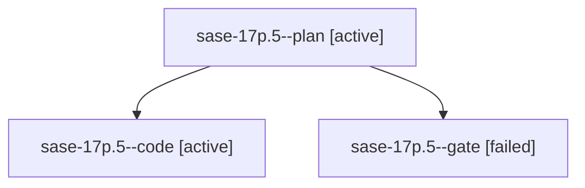

# Family: sase-17p.5

[Agent Hoods](../README.md) / [bbugyi200](../users/bbugyi200/README.md) / [athena](../users/bbugyi200/machines/athena/README.md) / [sase-17p](../users/bbugyi200/machines/athena/hoods/sase-17p/README.md) / sase-17p.5

Owner: `bbugyi200.athena` · Hood: `sase-17p` · Members: 3 · Bead: [sase-17p.5](https://github.com/sase-org/sase--beads/blob/main/pages/sase-17p/sase-17p.5.md)

## Lineage

The diagram is an optional enhancement; the ordered table below contains the same lineage in accessible text.

| Role | Agent | State | Model / provider | Timing | Commits | Prompt | Chat |
|---|---|---|---|---|---:|---|---|
| plan | sase-17p.5--plan | active | opus / claude | 2026-09-24T16:42:38.641878+00:00 | 0 | [Prompt](../agents/bbugyi200.athena.sase-17p.5--plan/prompt.md) | [Chat](../agents/bbugyi200.athena.sase-17p.5--plan/chat.md) |
| code | sase-17p.5--code | active | sonnet / claude | 2026-09-24T16:52:17.059299+00:00 | [1](../agents/bbugyi200.athena.sase-17p.5--code/README.md#commits) | — | — |
| gate | sase-17p.5--gate | failed | opus / claude | 2026-09-24T16:51:17.160414+00:00 → 2026-09-24T16:51:56.780959+00:00 | 0 | — | [Chat](../agents/bbugyi200.athena.sase-17p.5--gate/chat.md) |

## Commits

| Role | Repo | Commit | Subject | Committed |
|---|---|---|---|---|
| code | sase | [`7173669`](https://github.com/sase-org/sase/commit/71736697dcb97b14cceb96cf687dfa24d6454d17) | feat(tool): settle hand-off ToolRuns from owner facts and deliver once (sase-17p.5) | 2026-09-24 14:00:16 EDT |

## Neighbors

| Agent | Relation | State |
|---|---|---|
| [sase-17p.1](bbugyi200.athena.sase-17p.1.md) (family · 9) | sase-17p hood | active 7, completed 1, failed 1 |
| [sase-17p.2](bbugyi200.athena.sase-17p.2.md) (family · 3) | sase-17p hood | active 2, failed 1 |
| [sase-17p.2](../agents/bbugyi200.athena.sase-17p.2/README.md) | sase-17p hood | waiting |
| [sase-17p.3](../agents/bbugyi200.athena.sase-17p.3/README.md) | sase-17p hood | active |
| [sase-17p.4](../agents/bbugyi200.athena.sase-17p.4/README.md) | sase-17p hood | active |
| [sase-17p.6](../agents/bbugyi200.athena.sase-17p.6/README.md) | sase-17p hood | active |
| [sase-17p.land](../agents/bbugyi200.athena.sase-17p.land/README.md) | sase-17p hood | active |
