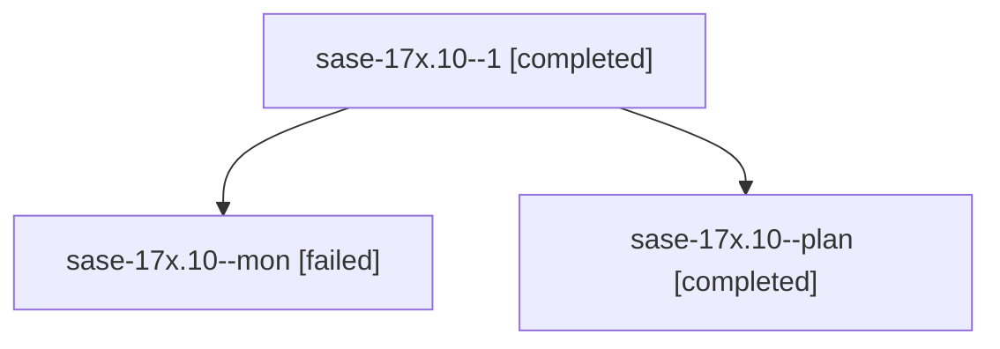

# Family: sase-17x.10

[Agent Hoods](../README.md) / [bbugyi200](../users/bbugyi200/README.md) / [athena](../users/bbugyi200/machines/athena/README.md) / [sase-17x](../users/bbugyi200/machines/athena/hoods/sase-17x/README.md) / sase-17x.10

Owner: `bbugyi200.athena` · Hood: `sase-17x` · Members: 3 · Bead: [sase-17x.10](https://github.com/sase-org/sase--beads/blob/main/pages/sase-17x/sase-17x.10.md)

## Lineage

The diagram is an optional enhancement; the ordered table below contains the same lineage in accessible text.

| Role | Agent | State | Model / provider | Timing | Commits | Prompt | Chat |
|---|---|---|---|---|---:|---|---|
| 1 | sase-17x.10--1 | completed | muse-spark-1.3-contributor / muse | 2026-09-24T20:22:10.722435+00:00 → 2026-09-24T21:06:46.885997+00:00 | [1](../agents/bbugyi200.athena.sase-17x.10--1/README.md#commits) | [Prompt](../agents/bbugyi200.athena.sase-17x.10--1/prompt.md) | [Chat](../agents/bbugyi200.athena.sase-17x.10--1/chat.md) |
| mon | sase-17x.10--mon | failed | muse-spark-1.3-contributor / muse | 2026-09-24T20:15:33.558744+00:00 → 2026-09-24T20:22:02.280253+00:00 | 0 | — | [Chat](../agents/bbugyi200.athena.sase-17x.10--mon/chat.md) |
| plan | sase-17x.10--plan | completed | muse-spark-1.3-contributor / muse | 2026-09-24T19:45:03.819766+00:00 → 2026-09-24T20:15:56.175833+00:00 | 0 | [Prompt](../agents/bbugyi200.athena.sase-17x.10--plan/prompt.md) | [Chat](../agents/bbugyi200.athena.sase-17x.10--plan/chat.md) |

## Commits

| Role | Repo | Commit | Subject | Committed |
|---|---|---|---|---|
| 1 | sase | [`c03c717`](https://github.com/sase-org/sase/commit/c03c717daebb74852c9c1f329e7aabd866cc2741) | feat(ace): command-line completion extras for sase-17x.10 | 2026-09-24 16:57:28 EDT |

## Neighbors

| Agent | Relation | State |
|---|---|---|
| [sase-17x.1](../agents/bbugyi200.athena.sase-17x.1/README.md) | sase-17x hood | completed |
| [sase-17x.11](../agents/bbugyi200.athena.sase-17x.11/README.md) | sase-17x hood | completed |
| [sase-17x.12](../agents/bbugyi200.athena.sase-17x.12/README.md) | sase-17x hood | completed |
| [sase-17x.13.1](../agents/bbugyi200.athena.sase-17x.13.1/README.md) | sase-17x hood | failed |
| [sase-17x.13.2](../agents/bbugyi200.athena.sase-17x.13.2/README.md) | sase-17x hood | completed |
| [sase-17x.13.3](bbugyi200.athena.sase-17x.13.3.md) (family · 5) | sase-17x hood | completed 3, failed 2 |
| [sase-17x.13.4](../agents/bbugyi200.athena.sase-17x.13.4/README.md) | sase-17x hood | completed |
| [sase-17x.13.5](../agents/bbugyi200.athena.sase-17x.13.5/README.md) | sase-17x hood | completed |
| [sase-17x.13.6](bbugyi200.athena.sase-17x.13.6.md) (family · 5) | sase-17x hood | completed 3, failed 2 |
| [sase-17x.13.7](../agents/bbugyi200.athena.sase-17x.13.7/README.md) | sase-17x hood | completed |
| [sase-17x.13.8](../agents/bbugyi200.athena.sase-17x.13.8/README.md) | sase-17x hood | active |
| [sase-17x.13.9](../agents/bbugyi200.athena.sase-17x.13.9/README.md) | sase-17x hood | waiting |
| [sase-17x.13.land](../agents/bbugyi200.athena.sase-17x.13.land/README.md) | sase-17x hood | waiting |
| [sase-17x.2](../agents/bbugyi200.athena.sase-17x.2/README.md) | sase-17x hood | completed |
| [sase-17x.3](../agents/bbugyi200.athena.sase-17x.3/README.md) | sase-17x hood | completed |
| [sase-17x.4](../agents/bbugyi200.athena.sase-17x.4/README.md) | sase-17x hood | completed |
| [sase-17x.5](bbugyi200.athena.sase-17x.5.md) (family · 3) | sase-17x hood | completed 2, failed 1 |
| [sase-17x.6](../agents/bbugyi200.athena.sase-17x.6/README.md) | sase-17x hood | completed |
| [sase-17x.7](../agents/bbugyi200.athena.sase-17x.7/README.md) | sase-17x hood | completed |
| [sase-17x.8](../agents/bbugyi200.athena.sase-17x.8/README.md) | sase-17x hood | completed |
| [sase-17x.9](../agents/bbugyi200.athena.sase-17x.9/README.md) | sase-17x hood | completed |
| [sase-17x.land](bbugyi200.athena.sase-17x.land.md) (family · 3) | sase-17x hood | failed 3 |
