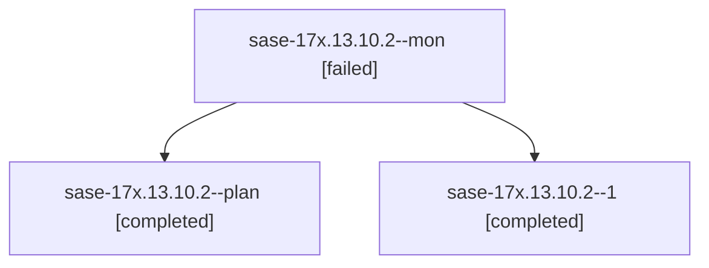

# Family: sase-17x.13.10.2

[Agent Hoods](../README.md) / [bbugyi200](../users/bbugyi200/README.md) / [athena](../users/bbugyi200/machines/athena/README.md) / [sase-17x](../users/bbugyi200/machines/athena/hoods/sase-17x/README.md) / sase-17x.13.10.2

Owner: `bbugyi200.athena` · Hood: `sase-17x` · Members: 3 · Bead: [sase-17x.13.10.2](https://github.com/sase-org/sase--beads/blob/main/pages/sase-17x/sase-17x.13.10.2.md)

## Lineage

The diagram is an optional enhancement; the ordered table below contains the same lineage in accessible text.

| Role | Agent | State | Model / provider | Timing | Commits | Prompt | Chat |
|---|---|---|---|---|---:|---|---|
| mon | sase-17x.13.10.2--mon | failed | gpt-5.6-terra / codex | 2026-09-25T12:56:39.324732+00:00 → 2026-09-25T13:43:09.819244+00:00 | 0 | — | [Chat](../agents/bbugyi200.athena.sase-17x.13.10.2--mon/chat.md) |
| plan | sase-17x.13.10.2--plan | completed | gpt-5.6-terra / codex | 2026-09-25T12:44:33.973591+00:00 → 2026-09-25T13:00:52.960666+00:00 | 0 | [Prompt](../agents/bbugyi200.athena.sase-17x.13.10.2--plan/prompt.md) | [Chat](../agents/bbugyi200.athena.sase-17x.13.10.2--plan/chat.md) |
| 1 | sase-17x.13.10.2--1 | completed | gpt-5.6-terra / codex | 2026-09-25T14:02:04.542576+00:00 → 2026-09-25T14:14:48.180485+00:00 | [1](../agents/bbugyi200.athena.sase-17x.13.10.2--1/README.md#commits) | [Prompt](../agents/bbugyi200.athena.sase-17x.13.10.2--1/prompt.md) | [Chat](../agents/bbugyi200.athena.sase-17x.13.10.2--1/chat.md) |

## Commits

| Role | Repo | Commit | Subject | Committed |
|---|---|---|---|---|
| 1 | sase | [`6d9d1b5`](https://github.com/sase-org/sase/commit/6d9d1b5a0023d8632cdccfd82beab0fd0f729e98) | fix(command-line): avoid panel dismissal deadlocks | 2026-09-25 10:07:12 EDT |

## Neighbors

| Agent | Relation | State |
|---|---|---|
| [sase-17x.13.10.1](bbugyi200.athena.sase-17x.13.10.1.md) (family · 3) | sase-17x.13.10 hood | completed 2, failed 1 |
| [sase-17x.13.10.3](../agents/bbugyi200.athena.sase-17x.13.10.3/README.md) | sase-17x.13.10 hood | completed |
| [sase-17x.13.10.4](../agents/bbugyi200.athena.sase-17x.13.10.4/README.md) | sase-17x.13.10 hood | active |
| [sase-17x.13.10.5](bbugyi200.athena.sase-17x.13.10.5.md) (family · 3) | sase-17x.13.10 hood | completed 2, failed 1 |
| [sase-17x.13.10.6](../agents/bbugyi200.athena.sase-17x.13.10.6/README.md) | sase-17x.13.10 hood | waiting |
| [sase-17x.13.10.land](../agents/bbugyi200.athena.sase-17x.13.10.land/README.md) | sase-17x.13.10 hood | waiting |
| [sase-17x.13.1](../agents/bbugyi200.athena.sase-17x.13.1/README.md) | sase-17x.13 hood | active |
| [sase-17x.13.2](../agents/bbugyi200.athena.sase-17x.13.2/README.md) | sase-17x.13 hood | completed |
| [sase-17x.13.3](bbugyi200.athena.sase-17x.13.3.md) (family · 5) | sase-17x.13 hood | completed 3, failed 2 |
| [sase-17x.13.4](../agents/bbugyi200.athena.sase-17x.13.4/README.md) | sase-17x.13 hood | completed |
| [sase-17x.13.5](../agents/bbugyi200.athena.sase-17x.13.5/README.md) | sase-17x.13 hood | completed |
| [sase-17x.13.6](bbugyi200.athena.sase-17x.13.6.md) (family · 5) | sase-17x.13 hood | completed 3, failed 2 |
| [sase-17x.13.7](../agents/bbugyi200.athena.sase-17x.13.7/README.md) | sase-17x.13 hood | completed |
| [sase-17x.13.8](../agents/bbugyi200.athena.sase-17x.13.8/README.md) | sase-17x.13 hood | completed |
| [sase-17x.13.9](bbugyi200.athena.sase-17x.13.9.md) (family · 15) | sase-17x.13 hood | completed 8, failed 7 |
| [sase-17x.13.land](bbugyi200.athena.sase-17x.13.land.md) (family · 3) | sase-17x.13 hood | failed 3 |
| [sase-17x.1](../agents/bbugyi200.athena.sase-17x.1/README.md) | sase-17x hood | active |
| [sase-17x.10](bbugyi200.athena.sase-17x.10.md) (family · 3) | sase-17x hood | active 3 |
| [sase-17x.11](../agents/bbugyi200.athena.sase-17x.11/README.md) | sase-17x hood | active |
| [sase-17x.12](../agents/bbugyi200.athena.sase-17x.12/README.md) | sase-17x hood | active |
| [sase-17x.2](../agents/bbugyi200.athena.sase-17x.2/README.md) | sase-17x hood | active |
| [sase-17x.3](../agents/bbugyi200.athena.sase-17x.3/README.md) | sase-17x hood | active |
| [sase-17x.4](../agents/bbugyi200.athena.sase-17x.4/README.md) | sase-17x hood | active |
| [sase-17x.5](bbugyi200.athena.sase-17x.5.md) (family · 3) | sase-17x hood | active 2, completed 1 |
| [sase-17x.6](../agents/bbugyi200.athena.sase-17x.6/README.md) | sase-17x hood | active |
| [sase-17x.7](../agents/bbugyi200.athena.sase-17x.7/README.md) | sase-17x hood | active |
| [sase-17x.8](../agents/bbugyi200.athena.sase-17x.8/README.md) | sase-17x hood | active |
| [sase-17x.9](../agents/bbugyi200.athena.sase-17x.9/README.md) | sase-17x hood | active |
| [sase-17x.land](bbugyi200.athena.sase-17x.land.md) (family · 3) | sase-17x hood | active 3 |
