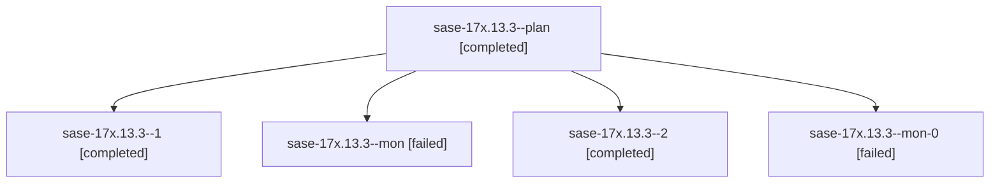

# Family: sase-17x.13.3

[Agent Hoods](../README.md) / [bbugyi200](../users/bbugyi200/README.md) / [athena](../users/bbugyi200/machines/athena/README.md) / [sase-17x](../users/bbugyi200/machines/athena/hoods/sase-17x/README.md) / sase-17x.13.3

Owner: `bbugyi200.athena` · Hood: `sase-17x` · Members: 5 · Bead: [sase-17x.13.3](https://github.com/sase-org/sase--beads/blob/main/pages/sase-17x/sase-17x.13.3.md)

## Lineage

The diagram is an optional enhancement; the ordered table below contains the same lineage in accessible text.

| Role | Agent | State | Model / provider | Timing | Commits | Prompt | Chat |
|---|---|---|---|---|---:|---|---|
| plan | sase-17x.13.3--plan | completed | gpt-5.6-terra / codex | 2026-09-25T01:14:21.096220+00:00 → 2026-09-25T01:25:51.103299+00:00 | 0 | [Prompt](../agents/bbugyi200.athena.sase-17x.13.3--plan/prompt.md) | [Chat](../agents/bbugyi200.athena.sase-17x.13.3--plan/chat.md) |
| 1 | sase-17x.13.3--1 | completed | gpt-5.6-terra / codex | 2026-09-25T01:31:23.593848+00:00 → 2026-09-25T01:38:08.708764+00:00 | 0 | [Prompt](../agents/bbugyi200.athena.sase-17x.13.3--1/prompt.md) | [Chat](../agents/bbugyi200.athena.sase-17x.13.3--1/chat.md) |
| mon | sase-17x.13.3--mon | failed | gpt-5.6-terra / codex | 2026-09-25T01:25:07.158966+00:00 → 2026-09-25T01:28:28.701992+00:00 | 0 | — | [Chat](../agents/bbugyi200.athena.sase-17x.13.3--mon/chat.md) |
| 2 | sase-17x.13.3--2 | completed | gpt-5.6-terra / codex | 2026-09-25T01:50:21.640367+00:00 → 2026-09-25T01:57:17.811352+00:00 | [1](../agents/bbugyi200.athena.sase-17x.13.3--2/README.md#commits) | [Prompt](../agents/bbugyi200.athena.sase-17x.13.3--2/prompt.md) | [Chat](../agents/bbugyi200.athena.sase-17x.13.3--2/chat.md) |
| mon-0 | sase-17x.13.3--mon-0 | failed | gpt-5.6-terra / codex | 2026-09-25T01:37:07.364629+00:00 → 2026-09-25T01:49:57.432880+00:00 | 0 | — | [Chat](../agents/bbugyi200.athena.sase-17x.13.3--mon-0/chat.md) |

## Commits

| Role | Repo | Commit | Subject | Committed |
|---|---|---|---|---|
| 2 | sase | [`543d012`](https://github.com/sase-org/sase/commit/543d012209875d59081f8c4d908168c6687ac4e9) | feat(command-line): complete key behavior contract | 2026-09-24 21:54:35 EDT |

## Neighbors

| Agent | Relation | State |
|---|---|---|
| [sase-17x.13.1](../agents/bbugyi200.athena.sase-17x.13.1/README.md) | sase-17x.13 hood | failed |
| [sase-17x.13.2](../agents/bbugyi200.athena.sase-17x.13.2/README.md) | sase-17x.13 hood | completed |
| [sase-17x.13.4](../agents/bbugyi200.athena.sase-17x.13.4/README.md) | sase-17x.13 hood | completed |
| [sase-17x.13.5](../agents/bbugyi200.athena.sase-17x.13.5/README.md) | sase-17x.13 hood | completed |
| [sase-17x.13.6](bbugyi200.athena.sase-17x.13.6.md) (family · 5) | sase-17x.13 hood | completed 3, failed 2 |
| [sase-17x.13.7](../agents/bbugyi200.athena.sase-17x.13.7/README.md) | sase-17x.13 hood | completed |
| [sase-17x.13.8](../agents/bbugyi200.athena.sase-17x.13.8/README.md) | sase-17x.13 hood | active |
| [sase-17x.13.9](../agents/bbugyi200.athena.sase-17x.13.9/README.md) | sase-17x.13 hood | waiting |
| [sase-17x.13.land](../agents/bbugyi200.athena.sase-17x.13.land/README.md) | sase-17x.13 hood | waiting |
| [sase-17x.1](../agents/bbugyi200.athena.sase-17x.1/README.md) | sase-17x hood | completed |
| [sase-17x.10](bbugyi200.athena.sase-17x.10.md) (family · 3) | sase-17x hood | completed 2, failed 1 |
| [sase-17x.11](../agents/bbugyi200.athena.sase-17x.11/README.md) | sase-17x hood | completed |
| [sase-17x.12](../agents/bbugyi200.athena.sase-17x.12/README.md) | sase-17x hood | completed |
| [sase-17x.2](../agents/bbugyi200.athena.sase-17x.2/README.md) | sase-17x hood | completed |
| [sase-17x.3](../agents/bbugyi200.athena.sase-17x.3/README.md) | sase-17x hood | completed |
| [sase-17x.4](../agents/bbugyi200.athena.sase-17x.4/README.md) | sase-17x hood | completed |
| [sase-17x.5](bbugyi200.athena.sase-17x.5.md) (family · 3) | sase-17x hood | completed 2, failed 1 |
| [sase-17x.6](../agents/bbugyi200.athena.sase-17x.6/README.md) | sase-17x hood | completed |
| [sase-17x.7](../agents/bbugyi200.athena.sase-17x.7/README.md) | sase-17x hood | completed |
| [sase-17x.8](../agents/bbugyi200.athena.sase-17x.8/README.md) | sase-17x hood | completed |
| [sase-17x.9](../agents/bbugyi200.athena.sase-17x.9/README.md) | sase-17x hood | completed |
| [sase-17x.land](bbugyi200.athena.sase-17x.land.md) (family · 3) | sase-17x hood | failed 3 |
