# Family: sase-17x.13.9

[Agent Hoods](../README.md) / [bbugyi200](../users/bbugyi200/README.md) / [athena](../users/bbugyi200/machines/athena/README.md) / [sase-17x](../users/bbugyi200/machines/athena/hoods/sase-17x/README.md) / sase-17x.13.9

Owner: `bbugyi200.athena` · Hood: `sase-17x` · Members: 15 · Bead: [sase-17x.13.9](https://github.com/sase-org/sase--beads/blob/main/pages/sase-17x/sase-17x.13.9.md)

## Lineage

```mermaid
flowchart TD
  n0["sase-17x.13.9--1 [completed]"]
  n1["sase-17x.13.9--mon-3 [failed]"]
  n0 --> n1
  n2["sase-17x.13.9--4 [completed]"]
  n0 --> n2
  n3["sase-17x.13.9--3 [completed]"]
  n0 --> n3
  n4["sase-17x.13.9--mon-2 [failed]"]
  n0 --> n4
  n5["sase-17x.13.9--6 [completed]"]
  n0 --> n5
  n6["sase-17x.13.9--mon-4 [failed]"]
  n0 --> n6
  n7["sase-17x.13.9--mon-0 [failed]"]
  n0 --> n7
  n8["sase-17x.13.9--plan [completed]"]
  n0 --> n8
  n9["sase-17x.13.9--7 [active]"]
  n0 --> n9
  n10["sase-17x.13.9--mon-1 [failed]"]
  n0 --> n10
  n11["sase-17x.13.9--mon-5 [failed]"]
  n0 --> n11
  n12["sase-17x.13.9--5 [completed]"]
  n0 --> n12
  n13["sase-17x.13.9--mon [failed]"]
  n0 --> n13
  n14["sase-17x.13.9--2 [completed]"]
  n0 --> n14
```

The diagram is an optional enhancement; the ordered table below contains the same lineage in accessible text.

| Role | Agent | State | Model / provider | Timing | Commits | Prompt | Chat |
|---|---|---|---|---|---:|---|---|
| 1 | sase-17x.13.9--1 | completed | gpt-5.6-terra / codex | 2026-09-25T07:11:38.279199+00:00 → 2026-09-25T07:16:12.396647+00:00 | 0 | [Prompt](../agents/bbugyi200.athena.sase-17x.13.9--1/prompt.md) | [Chat](../agents/bbugyi200.athena.sase-17x.13.9--1/chat.md) |
| mon-3 | sase-17x.13.9--mon-3 | failed | gpt-5.6-terra / codex | 2026-09-25T07:40:55.110154+00:00 → 2026-09-25T07:47:13.933400+00:00 | 0 | — | [Chat](../agents/bbugyi200.athena.sase-17x.13.9--mon-3/chat.md) |
| 4 | sase-17x.13.9--4 | completed | gpt-5.6-terra / codex | 2026-09-25T07:27:56.904066+00:00 → 2026-09-25T07:41:27.544697+00:00 | 0 | [Prompt](../agents/bbugyi200.athena.sase-17x.13.9--4/prompt.md) | [Chat](../agents/bbugyi200.athena.sase-17x.13.9--4/chat.md) |
| 3 | sase-17x.13.9--3 | completed | gpt-5.6-terra / codex | 2026-09-25T07:23:50.934656+00:00 → 2026-09-25T07:26:28.250446+00:00 | 0 | [Prompt](../agents/bbugyi200.athena.sase-17x.13.9--3/prompt.md) | [Chat](../agents/bbugyi200.athena.sase-17x.13.9--3/chat.md) |
| mon-2 | sase-17x.13.9--mon-2 | failed | gpt-5.6-terra / codex | 2026-09-25T07:26:00.877202+00:00 → 2026-09-25T07:27:50.181467+00:00 | 0 | — | [Chat](../agents/bbugyi200.athena.sase-17x.13.9--mon-2/chat.md) |
| 6 | sase-17x.13.9--6 | completed | gpt-5.6-terra / codex | 2026-09-25T07:50:53.771526+00:00 → 2026-09-25T07:54:31.184966+00:00 | 0 | [Prompt](../agents/bbugyi200.athena.sase-17x.13.9--6/prompt.md) | [Chat](../agents/bbugyi200.athena.sase-17x.13.9--6/chat.md) |
| mon-4 | sase-17x.13.9--mon-4 | failed | gpt-5.6-terra / codex | 2026-09-25T07:49:01.365902+00:00 → 2026-09-25T07:50:47.528816+00:00 | 0 | — | [Chat](../agents/bbugyi200.athena.sase-17x.13.9--mon-4/chat.md) |
| mon-0 | sase-17x.13.9--mon-0 | failed | gpt-5.6-terra / codex | 2026-09-25T07:15:50.141403+00:00 → 2026-09-25T07:18:34.101805+00:00 | 0 | — | [Chat](../agents/bbugyi200.athena.sase-17x.13.9--mon-0/chat.md) |
| plan | sase-17x.13.9--plan | completed | gpt-5.6-terra / codex | 2026-09-25T06:37:07.937590+00:00 → 2026-09-25T07:05:37.255576+00:00 | 0 | [Prompt](../agents/bbugyi200.athena.sase-17x.13.9--plan/prompt.md) | [Chat](../agents/bbugyi200.athena.sase-17x.13.9--plan/chat.md) |
| 7 | sase-17x.13.9--7 | active | gpt-5.6-terra / codex | 2026-09-25T07:59:45.062979+00:00 | [1](../agents/bbugyi200.athena.sase-17x.13.9--7/README.md#commits) | [Prompt](../agents/bbugyi200.athena.sase-17x.13.9--7/prompt.md) | — |
| mon-1 | sase-17x.13.9--mon-1 | failed | gpt-5.6-terra / codex | 2026-09-25T07:20:58.561975+00:00 → 2026-09-25T07:23:42.803540+00:00 | 0 | — | [Chat](../agents/bbugyi200.athena.sase-17x.13.9--mon-1/chat.md) |
| mon-5 | sase-17x.13.9--mon-5 | failed | gpt-5.6-terra / codex | 2026-09-25T07:54:07.860402+00:00 → 2026-09-25T07:59:38.514905+00:00 | 0 | — | [Chat](../agents/bbugyi200.athena.sase-17x.13.9--mon-5/chat.md) |
| 5 | sase-17x.13.9--5 | completed | gpt-5.6-terra / codex | 2026-09-25T07:47:17.284754+00:00 → 2026-09-25T07:49:25.248181+00:00 | 0 | [Prompt](../agents/bbugyi200.athena.sase-17x.13.9--5/prompt.md) | [Chat](../agents/bbugyi200.athena.sase-17x.13.9--5/chat.md) |
| mon | sase-17x.13.9--mon | failed | gpt-5.6-terra / codex | 2026-09-25T07:05:08.086374+00:00 → 2026-09-25T07:11:27.944780+00:00 | 0 | — | [Chat](../agents/bbugyi200.athena.sase-17x.13.9--mon/chat.md) |
| 2 | sase-17x.13.9--2 | completed | gpt-5.6-terra / codex | 2026-09-25T07:18:42.092886+00:00 → 2026-09-25T07:21:23.519299+00:00 | 0 | [Prompt](../agents/bbugyi200.athena.sase-17x.13.9--2/prompt.md) | [Chat](../agents/bbugyi200.athena.sase-17x.13.9--2/chat.md) |

## Commits

| Role | Repo | Commit | Subject | Committed |
|---|---|---|---|---|
| 7 | sase | [`3c6e8f0`](https://github.com/sase-org/sase/commit/3c6e8f04dcdbd0806909d519ef3c661efbfde87a) | feat(command-line): add completion goldens and perf probe | 2026-09-25 04:02:20 EDT |

## Neighbors

| Agent | Relation | State |
|---|---|---|
| [sase-17x.13.1](../agents/bbugyi200.athena.sase-17x.13.1/README.md) | sase-17x.13 hood | failed |
| [sase-17x.13.2](../agents/bbugyi200.athena.sase-17x.13.2/README.md) | sase-17x.13 hood | completed |
| [sase-17x.13.3](bbugyi200.athena.sase-17x.13.3.md) (family · 5) | sase-17x.13 hood | completed 3, failed 2 |
| [sase-17x.13.4](../agents/bbugyi200.athena.sase-17x.13.4/README.md) | sase-17x.13 hood | completed |
| [sase-17x.13.5](../agents/bbugyi200.athena.sase-17x.13.5/README.md) | sase-17x.13 hood | completed |
| [sase-17x.13.6](bbugyi200.athena.sase-17x.13.6.md) (family · 5) | sase-17x.13 hood | completed 3, failed 2 |
| [sase-17x.13.7](../agents/bbugyi200.athena.sase-17x.13.7/README.md) | sase-17x.13 hood | completed |
| [sase-17x.13.8](../agents/bbugyi200.athena.sase-17x.13.8/README.md) | sase-17x.13 hood | completed |
| [sase-17x.13.land](../agents/bbugyi200.athena.sase-17x.13.land/README.md) | sase-17x.13 hood | waiting |
| [sase-17x.1](../agents/bbugyi200.athena.sase-17x.1/README.md) | sase-17x hood | completed |
| [sase-17x.10](bbugyi200.athena.sase-17x.10.md) (family · 3) | sase-17x hood | completed 2, failed 1 |
| [sase-17x.11](../agents/bbugyi200.athena.sase-17x.11/README.md) | sase-17x hood | completed |
| [sase-17x.12](../agents/bbugyi200.athena.sase-17x.12/README.md) | sase-17x hood | completed |
| [sase-17x.2](../agents/bbugyi200.athena.sase-17x.2/README.md) | sase-17x hood | completed |
| [sase-17x.3](../agents/bbugyi200.athena.sase-17x.3/README.md) | sase-17x hood | completed |
| [sase-17x.4](../agents/bbugyi200.athena.sase-17x.4/README.md) | sase-17x hood | completed |
| [sase-17x.5](bbugyi200.athena.sase-17x.5.md) (family · 3) | sase-17x hood | completed 2, failed 1 |
| [sase-17x.6](../agents/bbugyi200.athena.sase-17x.6/README.md) | sase-17x hood | completed |
| [sase-17x.7](../agents/bbugyi200.athena.sase-17x.7/README.md) | sase-17x hood | completed |
| [sase-17x.8](../agents/bbugyi200.athena.sase-17x.8/README.md) | sase-17x hood | completed |
| [sase-17x.9](../agents/bbugyi200.athena.sase-17x.9/README.md) | sase-17x hood | completed |
| [sase-17x.land](bbugyi200.athena.sase-17x.land.md) (family · 3) | sase-17x hood | failed 3 |
