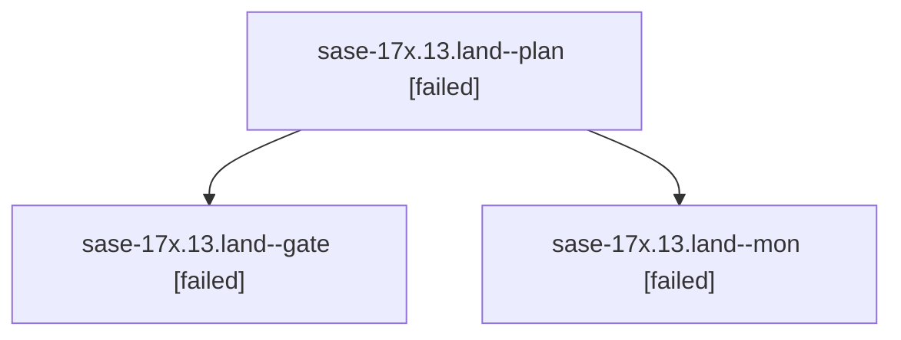

# Family: sase-17x.13.land

[Agent Hoods](../README.md) / [bbugyi200](../users/bbugyi200/README.md) / [athena](../users/bbugyi200/machines/athena/README.md) / [sase-17x](../users/bbugyi200/machines/athena/hoods/sase-17x/README.md) / sase-17x.13.land

Owner: `bbugyi200.athena` · Hood: `sase-17x` · Members: 3 · Bead: [sase-17x.13](https://github.com/sase-org/sase--beads/blob/main/pages/sase-17x/sase-17x.13.md)

## Lineage

The diagram is an optional enhancement; the ordered table below contains the same lineage in accessible text.

| Role | Agent | State | Model / provider | Timing | Commits | Prompt | Chat |
|---|---|---|---|---|---:|---|---|
| plan | sase-17x.13.land--plan | failed | opus / claude | 2026-09-25T10:59:04.097982+00:00 → 2026-09-25T12:41:59.301735+00:00 | 0 | [Prompt](../agents/bbugyi200.athena.sase-17x.13.land--plan/prompt.md) | [Chat](../agents/bbugyi200.athena.sase-17x.13.land--plan/chat.md) |
| gate | sase-17x.13.land--gate | failed | opus / claude | 2026-09-25T12:40:11.742235+00:00 → 2026-09-25T12:41:27.396956+00:00 | 0 | — | [Chat](../agents/bbugyi200.athena.sase-17x.13.land--gate/chat.md) |
| mon | sase-17x.13.land--mon | failed | opus / claude | 2026-09-25T12:41:24.278431+00:00 → 2026-09-25T12:46:14.587004+00:00 | 0 | — | [Chat](../agents/bbugyi200.athena.sase-17x.13.land--mon/chat.md) |

## Neighbors

| Agent | Relation | State |
|---|---|---|
| [sase-17x.13.1](../agents/bbugyi200.athena.sase-17x.13.1/README.md) | sase-17x.13 hood | active |
| [sase-17x.13.10.1](bbugyi200.athena.sase-17x.13.10.1.md) (family · 3) | sase-17x.13 hood | completed 2, failed 1 |
| [sase-17x.13.10.2](bbugyi200.athena.sase-17x.13.10.2.md) (family · 3) | sase-17x.13 hood | completed 2, failed 1 |
| [sase-17x.13.10.3](../agents/bbugyi200.athena.sase-17x.13.10.3/README.md) | sase-17x.13 hood | completed |
| [sase-17x.13.10.4](../agents/bbugyi200.athena.sase-17x.13.10.4/README.md) | sase-17x.13 hood | active |
| [sase-17x.13.10.5](bbugyi200.athena.sase-17x.13.10.5.md) (family · 3) | sase-17x.13 hood | completed 2, failed 1 |
| [sase-17x.13.10.6](../agents/bbugyi200.athena.sase-17x.13.10.6/README.md) | sase-17x.13 hood | waiting |
| [sase-17x.13.10.land](../agents/bbugyi200.athena.sase-17x.13.10.land/README.md) | sase-17x.13 hood | waiting |
| [sase-17x.13.2](../agents/bbugyi200.athena.sase-17x.13.2/README.md) | sase-17x.13 hood | completed |
| [sase-17x.13.3](bbugyi200.athena.sase-17x.13.3.md) (family · 5) | sase-17x.13 hood | completed 3, failed 2 |
| [sase-17x.13.4](../agents/bbugyi200.athena.sase-17x.13.4/README.md) | sase-17x.13 hood | completed |
| [sase-17x.13.5](../agents/bbugyi200.athena.sase-17x.13.5/README.md) | sase-17x.13 hood | completed |
| [sase-17x.13.6](bbugyi200.athena.sase-17x.13.6.md) (family · 5) | sase-17x.13 hood | completed 3, failed 2 |
| [sase-17x.13.7](../agents/bbugyi200.athena.sase-17x.13.7/README.md) | sase-17x.13 hood | completed |
| [sase-17x.13.8](../agents/bbugyi200.athena.sase-17x.13.8/README.md) | sase-17x.13 hood | completed |
| [sase-17x.13.9](bbugyi200.athena.sase-17x.13.9.md) (family · 15) | sase-17x.13 hood | completed 8, failed 7 |
| [sase-17x.1](../agents/bbugyi200.athena.sase-17x.1/README.md) | sase-17x hood | active |
| [sase-17x.10](bbugyi200.athena.sase-17x.10.md) (family · 3) | sase-17x hood | active 3 |
| [sase-17x.11](../agents/bbugyi200.athena.sase-17x.11/README.md) | sase-17x hood | active |
| [sase-17x.12](../agents/bbugyi200.athena.sase-17x.12/README.md) | sase-17x hood | active |
| [sase-17x.2](../agents/bbugyi200.athena.sase-17x.2/README.md) | sase-17x hood | active |
| [sase-17x.3](../agents/bbugyi200.athena.sase-17x.3/README.md) | sase-17x hood | active |
| [sase-17x.4](../agents/bbugyi200.athena.sase-17x.4/README.md) | sase-17x hood | active |
| [sase-17x.5](bbugyi200.athena.sase-17x.5.md) (family · 3) | sase-17x hood | active 2, completed 1 |
| [sase-17x.6](../agents/bbugyi200.athena.sase-17x.6/README.md) | sase-17x hood | active |
| [sase-17x.7](../agents/bbugyi200.athena.sase-17x.7/README.md) | sase-17x hood | active |
| [sase-17x.8](../agents/bbugyi200.athena.sase-17x.8/README.md) | sase-17x hood | active |
| [sase-17x.9](../agents/bbugyi200.athena.sase-17x.9/README.md) | sase-17x hood | active |
| [sase-17x.land](bbugyi200.athena.sase-17x.land.md) (family · 3) | sase-17x hood | active 3 |
