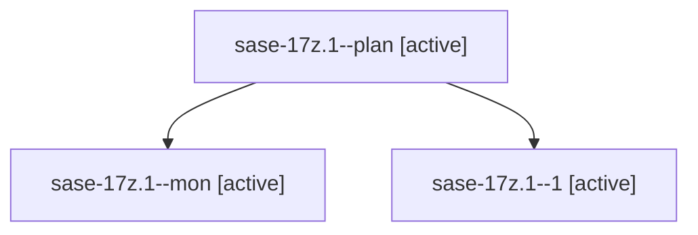

# Family: sase-17z.1

[Agent Hoods](../README.md) / [bbugyi200](../users/bbugyi200/README.md) / [athena](../users/bbugyi200/machines/athena/README.md) / [sase-17z](../users/bbugyi200/machines/athena/hoods/sase-17z/README.md) / sase-17z.1

Owner: `bbugyi200.athena` · Hood: `sase-17z` · Members: 3 · Bead: [sase-17z.1](https://github.com/sase-org/sase--beads/blob/main/pages/sase-17z/sase-17z.1.md)

## Lineage

The diagram is an optional enhancement; the ordered table below contains the same lineage in accessible text.

| Role | Agent | State | Model / provider | Timing | Commits | Prompt | Chat |
|---|---|---|---|---|---:|---|---|
| plan | sase-17z.1--plan | active | muse-spark-1.3-contributor / muse | 2026-09-24T16:17:38.495585+00:00 | 0 | [Prompt](../agents/bbugyi200.athena.sase-17z.1--plan/prompt.md) | [Chat](../agents/bbugyi200.athena.sase-17z.1--plan/chat.md) |
| mon | sase-17z.1--mon | active | muse-spark-1.3-contributor / muse | 2026-09-24T16:49:26.721241+00:00 | 0 | — | [Chat](../agents/bbugyi200.athena.sase-17z.1--mon/chat.md) |
| 1 | sase-17z.1--1 | active | muse-spark-1.3-contributor / muse | 2026-09-24T17:10:49.853581+00:00 | [1](../agents/bbugyi200.athena.sase-17z.1--1/README.md#commits) | [Prompt](../agents/bbugyi200.athena.sase-17z.1--1/prompt.md) | [Chat](../agents/bbugyi200.athena.sase-17z.1--1/chat.md) |

## Commits

| Role | Repo | Commit | Subject | Committed |
|---|---|---|---|---|
| 1 | sase | [`2bdd70c`](https://github.com/sase-org/sase/commit/2bdd70c2d5d7c5fd09e2a23e32fce53a47512e28) | feat(plan): gate-owned pending visibility and name-first selector resolver (sase-17z.1) | 2026-09-24 13:16:04 EDT |

## Neighbors

| Agent | Relation | State |
|---|---|---|
| [sase-17z.2](../agents/bbugyi200.athena.sase-17z.2/README.md) | sase-17z hood | active |
| [sase-17z.3](../agents/bbugyi200.athena.sase-17z.3/README.md) | sase-17z hood | active |
| [sase-17z.land](../agents/bbugyi200.athena.sase-17z.land/README.md) | sase-17z hood | active |
