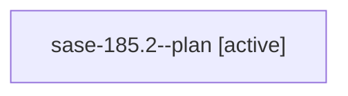

# Family: sase-185.2

[Agent Hoods](../README.md) / [bbugyi200](../users/bbugyi200/README.md) / [athena](../users/bbugyi200/machines/athena/README.md) / [sase-185](../users/bbugyi200/machines/athena/hoods/sase-185/README.md) / sase-185.2

Owner: `bbugyi200.athena` · Hood: `sase-185` · Members: 1 · Bead: [sase-185.2](https://github.com/sase-org/sase--beads/blob/main/pages/sase-185/sase-185.2.md)

## Lineage

The diagram is an optional enhancement; the ordered table below contains the same lineage in accessible text.

| Role | Agent | State | Model / provider | Timing | Commits | Prompt | Chat |
|---|---|---|---|---|---:|---|---|
| plan | sase-185.2--plan | active | gpt-5.6-terra / codex | 2026-09-24T20:05:59.433791+00:00 | [1](../agents/bbugyi200.athena.sase-185.2--plan/README.md#commits) | [Prompt](../agents/bbugyi200.athena.sase-185.2--plan/prompt.md) | [Chat](../agents/bbugyi200.athena.sase-185.2--plan/chat.md) |

## Commits

| Role | Repo | Commit | Subject | Committed |
|---|---|---|---|---|
| plan | sase | [`93d8d41`](https://github.com/sase-org/sase/commit/93d8d4140cea62629942839fa9eee8c962fcf5a0) | feat(ace): detach accepted agent launch guards | 2026-09-24 16:17:44 EDT |

## Neighbors

| Agent | Relation | State |
|---|---|---|
| [sase-185.1](../agents/bbugyi200.athena.sase-185.1/README.md) | sase-185 hood | active |
| [sase-185.3](../agents/bbugyi200.athena.sase-185.3/README.md) | sase-185 hood | active |
| [sase-185.4](../agents/bbugyi200.athena.sase-185.4/README.md) | sase-185 hood | active |
| [sase-185.land](../agents/bbugyi200.athena.sase-185.land/README.md) | sase-185 hood | active |
