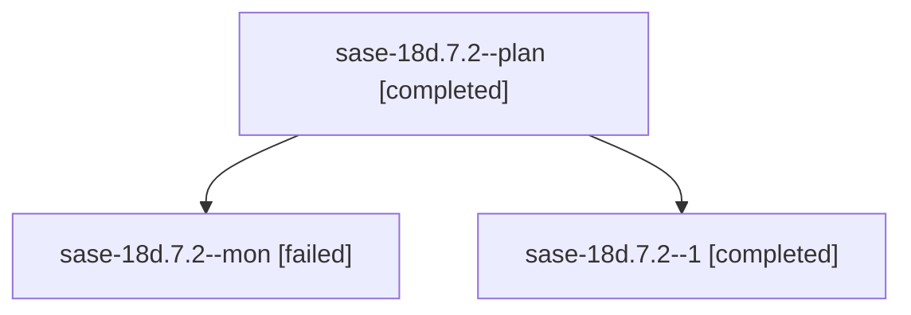

# Family: sase-18d.7.2

[Agent Hoods](../README.md) / [bbugyi200](../users/bbugyi200/README.md) / [athena](../users/bbugyi200/machines/athena/README.md) / [sase-18d](../users/bbugyi200/machines/athena/hoods/sase-18d/README.md) / sase-18d.7.2

Owner: `bbugyi200.athena` · Hood: `sase-18d` · Members: 3 · Bead: [sase-18d.7.2](https://github.com/sase-org/sase--beads/blob/main/pages/sase-18d/sase-18d.7.2.md)

## Lineage

The diagram is an optional enhancement; the ordered table below contains the same lineage in accessible text.

| Role | Agent | State | Model / provider | Timing | Commits | Prompt | Chat |
|---|---|---|---|---|---:|---|---|
| plan | sase-18d.7.2--plan | completed | muse-spark-1.3-contributor / muse | 2026-09-25T03:58:09.111475+00:00 → 2026-09-25T04:58:23.524176+00:00 | 0 | [Prompt](../agents/bbugyi200.athena.sase-18d.7.2--plan/prompt.md) | [Chat](../agents/bbugyi200.athena.sase-18d.7.2--plan/chat.md) |
| mon | sase-18d.7.2--mon | failed | muse-spark-1.3-contributor / muse | 2026-09-25T04:57:21.118832+00:00 → 2026-09-25T05:00:54.318014+00:00 | 0 | — | [Chat](../agents/bbugyi200.athena.sase-18d.7.2--mon/chat.md) |
| 1 | sase-18d.7.2--1 | completed | muse-spark-1.3-contributor / muse | 2026-09-25T05:01:26.322845+00:00 → 2026-09-25T05:10:10.221655+00:00 | [1](../agents/bbugyi200.athena.sase-18d.7.2--1/README.md#commits) | [Prompt](../agents/bbugyi200.athena.sase-18d.7.2--1/prompt.md) | [Chat](../agents/bbugyi200.athena.sase-18d.7.2--1/chat.md) |

## Commits

| Role | Repo | Commit | Subject | Committed |
|---|---|---|---|---|
| 1 | sase | [`02c4b02`](https://github.com/sase-org/sase/commit/02c4b029a67b743d45c564840c12adca8c4f3029) | test(ace): complete Agents-tab x row-lifecycle e2e coverage (sase-18d.7.2) | 2026-09-25 01:05:35 EDT |

## Neighbors

| Agent | Relation | State |
|---|---|---|
| [sase-18d.7.1](../agents/bbugyi200.athena.sase-18d.7.1/README.md) | sase-18d.7 hood | completed |
| [sase-18d.7.land](../agents/bbugyi200.athena.sase-18d.7.land/README.md) | sase-18d.7 hood | active |
| [sase-18d.1](../agents/bbugyi200.athena.sase-18d.1/README.md) | sase-18d hood | completed |
| [sase-18d.2](../agents/bbugyi200.athena.sase-18d.2/README.md) | sase-18d hood | completed |
| [sase-18d.3](../agents/bbugyi200.athena.sase-18d.3/README.md) | sase-18d hood | completed |
| [sase-18d.4](../agents/bbugyi200.athena.sase-18d.4/README.md) | sase-18d hood | completed |
| [sase-18d.5](../agents/bbugyi200.athena.sase-18d.5/README.md) | sase-18d hood | completed |
| [sase-18d.6](../agents/bbugyi200.athena.sase-18d.6/README.md) | sase-18d hood | completed |
| [sase-18d.land](bbugyi200.athena.sase-18d.land.md) (family · 3) | sase-18d hood | failed 3 |
