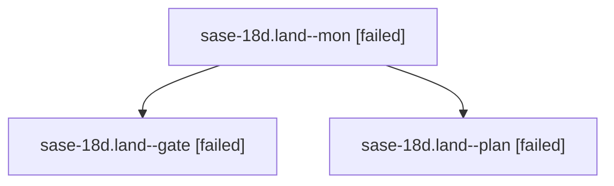

# Family: sase-18d.land

[Agent Hoods](../README.md) / [bbugyi200](../users/bbugyi200/README.md) / [athena](../users/bbugyi200/machines/athena/README.md) / [sase-18d](../users/bbugyi200/machines/athena/hoods/sase-18d/README.md) / sase-18d.land

Owner: `bbugyi200.athena` · Hood: `sase-18d` · Members: 3 · Bead: [sase-18d](https://github.com/sase-org/sase--beads/blob/main/pages/sase-18d/README.md)

## Lineage

The diagram is an optional enhancement; the ordered table below contains the same lineage in accessible text.

| Role | Agent | State | Model / provider | Timing | Commits | Prompt | Chat |
|---|---|---|---|---|---:|---|---|
| mon | sase-18d.land--mon | failed | gpt-6-sol / codex | 2026-09-25T02:00:07.700526+00:00 → 2026-09-25T02:03:37.698757+00:00 | 0 | — | [Chat](../agents/bbugyi200.athena.sase-18d.land--mon/chat.md) |
| gate | sase-18d.land--gate | failed | gpt-6-sol / codex | 2026-09-25T01:59:07.411671+00:00 → 2026-09-25T02:00:09.335747+00:00 | 0 | — | [Chat](../agents/bbugyi200.athena.sase-18d.land--gate/chat.md) |
| plan | sase-18d.land--plan | failed | gpt-6-sol / codex | 2026-09-25T01:52:03.816647+00:00 → 2026-09-25T02:00:32.535541+00:00 | 0 | [Prompt](../agents/bbugyi200.athena.sase-18d.land--plan/prompt.md) | [Chat](../agents/bbugyi200.athena.sase-18d.land--plan/chat.md) |

## Neighbors

| Agent | Relation | State |
|---|---|---|
| [sase-18d.1](../agents/bbugyi200.athena.sase-18d.1/README.md) | sase-18d hood | completed |
| [sase-18d.2](../agents/bbugyi200.athena.sase-18d.2/README.md) | sase-18d hood | completed |
| [sase-18d.3](../agents/bbugyi200.athena.sase-18d.3/README.md) | sase-18d hood | completed |
| [sase-18d.4](../agents/bbugyi200.athena.sase-18d.4/README.md) | sase-18d hood | completed |
| [sase-18d.5](../agents/bbugyi200.athena.sase-18d.5/README.md) | sase-18d hood | completed |
| [sase-18d.6](../agents/bbugyi200.athena.sase-18d.6/README.md) | sase-18d hood | completed |
| [sase-18d.7.1](../agents/bbugyi200.athena.sase-18d.7.1/README.md) | sase-18d hood | completed |
| [sase-18d.7.2](bbugyi200.athena.sase-18d.7.2.md) (family · 3) | sase-18d hood | completed 2, failed 1 |
| [sase-18d.7.land](../agents/bbugyi200.athena.sase-18d.7.land/README.md) | sase-18d hood | active |
