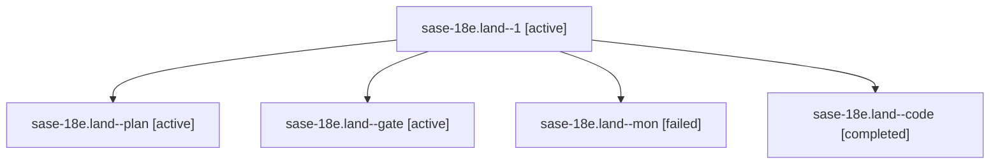

# Family: sase-18e.land

[Agent Hoods](../README.md) / [bbugyi200](../users/bbugyi200/README.md) / [athena](../users/bbugyi200/machines/athena/README.md) / [sase-18e](../users/bbugyi200/machines/athena/hoods/sase-18e/README.md) / sase-18e.land

Owner: `bbugyi200.athena` · Hood: `sase-18e` · Members: 5 · Bead: [sase-18e](https://github.com/sase-org/sase--beads/blob/main/pages/sase-18e/README.md)

## Lineage

The diagram is an optional enhancement; the ordered table below contains the same lineage in accessible text.

| Role | Agent | State | Model / provider | Timing | Commits | Prompt | Chat |
|---|---|---|---|---|---:|---|---|
| 1 | sase-18e.land--1 | active | muse-spark-1.3-contributor / muse | 2026-09-25T00:08:14.750998+00:00 | [1](../agents/bbugyi200.athena.sase-18e.land--1/README.md#commits) | [Prompt](../agents/bbugyi200.athena.sase-18e.land--1/prompt.md) | [Chat](../agents/bbugyi200.athena.sase-18e.land--1/chat.md) |
| plan | sase-18e.land--plan | active | gpt-6-sol / codex | 2026-09-24T23:20:24.137330+00:00 | 0 | [Prompt](../agents/bbugyi200.athena.sase-18e.land--plan/prompt.md) | [Chat](../agents/bbugyi200.athena.sase-18e.land--plan/chat.md) |
| gate | sase-18e.land--gate | active | gpt-6-sol / codex | 2026-09-24T23:27:01.839471+00:00 | 0 | — | [Chat](../agents/bbugyi200.athena.sase-18e.land--gate/chat.md) |
| mon | sase-18e.land--mon | failed | muse-spark-1.3-contributor / muse | 2026-09-24T23:33:18.609953+00:00 → 2026-09-24T23:38:03.329518+00:00 | 0 | — | [Chat](../agents/bbugyi200.athena.sase-18e.land--mon/chat.md) |
| code | sase-18e.land--code | completed | muse-spark-1.3-contributor / muse | 2026-09-24T23:30:19.692405+00:00 → 2026-09-24T23:33:41.139544+00:00 | 0 | — | [Chat](../agents/bbugyi200.athena.sase-18e.land--code/chat.md) |

## Commits

| Role | Repo | Commit | Subject | Committed |
|---|---|---|---|---|
| 1 | sase | [`4fb83bb`](https://github.com/sase-org/sase/commit/4fb83bb4faa269b8e43db21695879c34072c77de) | feat(monitor): pin sase-core past agent\_session filter and fix symvision survivors | 2026-09-24 20:24:59 EDT |

## Neighbors

| Agent | Relation | State |
|---|---|---|
| [sase-18e.1](../agents/bbugyi200.athena.sase-18e.1/README.md) | sase-18e hood | active |
| [sase-18e.2](../agents/bbugyi200.athena.sase-18e.2/README.md) | sase-18e hood | active |
| [sase-18e.3](../agents/bbugyi200.athena.sase-18e.3/README.md) | sase-18e hood | active |
