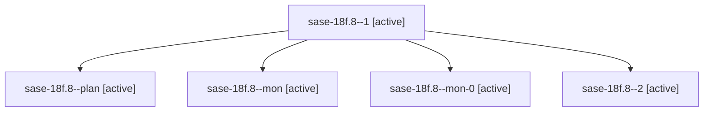

# Family: sase-18f.8

[Agent Hoods](../README.md) / [bbugyi200](../users/bbugyi200/README.md) / [athena](../users/bbugyi200/machines/athena/README.md) / [sase-18f](../users/bbugyi200/machines/athena/hoods/sase-18f/README.md) / sase-18f.8

Owner: `bbugyi200.athena` · Hood: `sase-18f` · Members: 5 · Bead: [sase-18f.8](https://github.com/sase-org/sase--beads/blob/main/pages/sase-18f/sase-18f.8.md)

## Lineage

The diagram is an optional enhancement; the ordered table below contains the same lineage in accessible text.

| Role | Agent | State | Model / provider | Timing | Commits | Prompt | Chat |
|---|---|---|---|---|---:|---|---|
| 1 | sase-18f.8--1 | active | gpt-5.6-terra / codex | 2026-09-24T23:09:40.590620+00:00 | 0 | [Prompt](../agents/bbugyi200.athena.sase-18f.8--1/prompt.md) | [Chat](../agents/bbugyi200.athena.sase-18f.8--1/chat.md) |
| plan | sase-18f.8--plan | active | gpt-5.6-terra / codex | 2026-09-24T22:08:57.898935+00:00 | 0 | [Prompt](../agents/bbugyi200.athena.sase-18f.8--plan/prompt.md) | [Chat](../agents/bbugyi200.athena.sase-18f.8--plan/chat.md) |
| mon | sase-18f.8--mon | active | gpt-5.6-terra / codex | 2026-09-24T22:17:35.376384+00:00 | 0 | — | [Chat](../agents/bbugyi200.athena.sase-18f.8--mon/chat.md) |
| mon-0 | sase-18f.8--mon-0 | active | gpt-5.6-terra / codex | 2026-09-24T23:15:46.320343+00:00 | 0 | — | [Chat](../agents/bbugyi200.athena.sase-18f.8--mon-0/chat.md) |
| 2 | sase-18f.8--2 | active | gpt-5.6-terra / codex | 2026-09-24T23:59:26.072636+00:00 | [1](../agents/bbugyi200.athena.sase-18f.8--2/README.md#commits) | [Prompt](../agents/bbugyi200.athena.sase-18f.8--2/prompt.md) | [Chat](../agents/bbugyi200.athena.sase-18f.8--2/chat.md) |

## Commits

| Role | Repo | Commit | Subject | Committed |
|---|---|---|---|---|
| 2 | sase | [`adebe40`](https://github.com/sase-org/sase/commit/adebe400d76371385f420710df6608ec219e8aab) | feat(cache): cache xprompt lsp build artifacts | 2026-09-24 20:02:37 EDT |

## Neighbors

| Agent | Relation | State |
|---|---|---|
| [sase-18f.1](../agents/bbugyi200.athena.sase-18f.1/README.md) | sase-18f hood | active |
| [sase-18f.2](../agents/bbugyi200.athena.sase-18f.2/README.md) | sase-18f hood | active |
| [sase-18f.3](../agents/bbugyi200.athena.sase-18f.3/README.md) | sase-18f hood | active |
| [sase-18f.4](../agents/bbugyi200.athena.sase-18f.4/README.md) | sase-18f hood | active |
| [sase-18f.5](../agents/bbugyi200.athena.sase-18f.5/README.md) | sase-18f hood | active |
| [sase-18f.6](../agents/bbugyi200.athena.sase-18f.6/README.md) | sase-18f hood | active |
| [sase-18f.7](../agents/bbugyi200.athena.sase-18f.7/README.md) | sase-18f hood | active |
| [sase-18f.9](../agents/bbugyi200.athena.sase-18f.9/README.md) | sase-18f hood | active |
| [sase-18f.land](../agents/bbugyi200.athena.sase-18f.land/README.md) | sase-18f hood | active |
