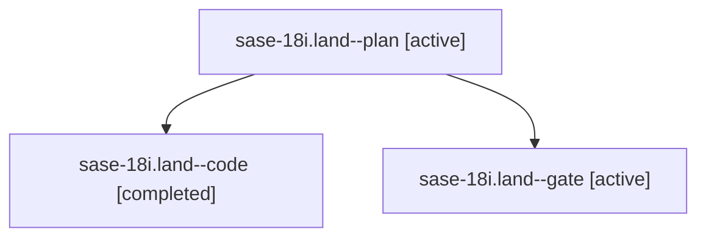

# Family: sase-18i.land

[Agent Hoods](../README.md) / [bbugyi200](../users/bbugyi200/README.md) / [athena](../users/bbugyi200/machines/athena/README.md) / [sase-18i](../users/bbugyi200/machines/athena/hoods/sase-18i/README.md) / sase-18i.land

Owner: `bbugyi200.athena` · Hood: `sase-18i` · Members: 3 · Bead: [sase-18i](https://github.com/sase-org/sase--beads/blob/main/pages/sase-18i/README.md)

## Lineage

The diagram is an optional enhancement; the ordered table below contains the same lineage in accessible text.

| Role | Agent | State | Model / provider | Timing | Commits | Prompt | Chat |
|---|---|---|---|---|---:|---|---|
| plan | sase-18i.land--plan | active | gpt-6-sol / codex | 2026-09-25T01:12:29.517111+00:00 | 0 | [Prompt](../agents/bbugyi200.athena.sase-18i.land--plan/prompt.md) | [Chat](../agents/bbugyi200.athena.sase-18i.land--plan/chat.md) |
| code | sase-18i.land--code | completed | sonnet / claude | 2026-09-25T01:24:57.584716+00:00 → 2026-09-25T02:31:42.305892+00:00 | [1](../agents/bbugyi200.athena.sase-18i.land--code/README.md#commits) | — | [Chat](../agents/bbugyi200.athena.sase-18i.land--code/chat.md) |
| gate | sase-18i.land--gate | active | gpt-6-sol / codex | 2026-09-25T01:22:59.374676+00:00 | 0 | — | [Chat](../agents/bbugyi200.athena.sase-18i.land--gate/chat.md) |

## Commits

| Role | Repo | Commit | Subject | Committed |
|---|---|---|---|---|
| code | sase | [`11b9c56`](https://github.com/sase-org/sase/commit/11b9c56b0d8f5ee36afca4cb11773438a9feb4a1) | fix(plan): emit session= coder prompts and settle concurrent gate answers | 2026-09-24 22:25:53 EDT |

## Neighbors

| Agent | Relation | State |
|---|---|---|
| [sase-18i.1](../agents/bbugyi200.athena.sase-18i.1/README.md) | sase-18i hood | active |
| [sase-18i.2](../agents/bbugyi200.athena.sase-18i.2/README.md) | sase-18i hood | active |
