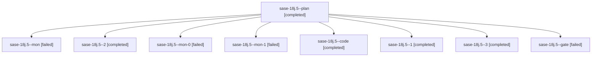

# Family: sase-18j.5

[Agent Hoods](../README.md) / [bbugyi200](../users/bbugyi200/README.md) / [athena](../users/bbugyi200/machines/athena/README.md) / [sase-18j](../users/bbugyi200/machines/athena/hoods/sase-18j/README.md) / sase-18j.5

Owner: `bbugyi200.athena` · Hood: `sase-18j` · Members: 9 · Bead: [sase-18j.5](https://github.com/sase-org/sase--beads/blob/main/pages/sase-18j/sase-18j.5.md)

## Lineage

The diagram is an optional enhancement; the ordered table below contains the same lineage in accessible text.

| Role | Agent | State | Model / provider | Timing | Commits | Prompt | Chat |
|---|---|---|---|---|---:|---|---|
| plan | sase-18j.5--plan | completed | opus / claude | 2026-09-25T01:37:28.909600+00:00 → 2026-09-25T02:00:56.828401+00:00 | 0 | [Prompt](../agents/bbugyi200.athena.sase-18j.5--plan/prompt.md) | [Chat](../agents/bbugyi200.athena.sase-18j.5--plan/chat.md) |
| mon | sase-18j.5--mon | failed | gpt-5.6-terra / codex | 2026-09-25T01:59:58.272550+00:00 → 2026-09-25T02:02:44.999458+00:00 | 0 | — | [Chat](../agents/bbugyi200.athena.sase-18j.5--mon/chat.md) |
| 2 | sase-18j.5--2 | completed | gpt-5.6-terra / codex | 2026-09-25T02:32:26.257278+00:00 → 2026-09-25T02:35:13.508609+00:00 | 0 | [Prompt](../agents/bbugyi200.athena.sase-18j.5--2/prompt.md) | [Chat](../agents/bbugyi200.athena.sase-18j.5--2/chat.md) |
| mon-0 | sase-18j.5--mon-0 | failed | gpt-5.6-terra / codex | 2026-09-25T02:06:31.653793+00:00 → 2026-09-25T02:10:46.381964+00:00 | 0 | — | [Chat](../agents/bbugyi200.athena.sase-18j.5--mon-0/chat.md) |
| mon-1 | sase-18j.5--mon-1 | failed | gpt-5.6-terra / codex | 2026-09-25T02:34:03.073206+00:00 → 2026-09-25T02:37:36.388246+00:00 | 0 | — | [Chat](../agents/bbugyi200.athena.sase-18j.5--mon-1/chat.md) |
| code | sase-18j.5--code | completed | gpt-5.6-terra / codex | 2026-09-25T01:47:46.225031+00:00 → 2026-09-25T02:00:56.828401+00:00 | 0 | — | [Chat](../agents/bbugyi200.athena.sase-18j.5--code/chat.md) |
| 1 | sase-18j.5--1 | completed | gpt-5.6-terra / codex | 2026-09-25T02:03:45.537645+00:00 → 2026-09-25T02:08:22.530881+00:00 | 0 | [Prompt](../agents/bbugyi200.athena.sase-18j.5--1/prompt.md) | [Chat](../agents/bbugyi200.athena.sase-18j.5--1/chat.md) |
| 3 | sase-18j.5--3 | completed | gpt-5.6-terra / codex | 2026-09-25T02:38:09.797256+00:00 → 2026-09-25T02:53:09.097407+00:00 | [1](../agents/bbugyi200.athena.sase-18j.5--3/README.md#commits) | [Prompt](../agents/bbugyi200.athena.sase-18j.5--3/prompt.md) | [Chat](../agents/bbugyi200.athena.sase-18j.5--3/chat.md) |
| gate | sase-18j.5--gate | failed | opus / claude | 2026-09-25T01:46:52.517965+00:00 → 2026-09-25T01:47:23.042539+00:00 | 0 | — | [Chat](../agents/bbugyi200.athena.sase-18j.5--gate/chat.md) |

## Commits

| Role | Repo | Commit | Subject | Committed |
|---|---|---|---|---|
| 3 | sase | [`cdcbcdd`](https://github.com/sase-org/sase/commit/cdcbcdd9d3988359f1b4fc77d6d0454632a4e760) | feat(tool): add triage input backtest | 2026-09-24 22:45:15 EDT |

## Neighbors

| Agent | Relation | State |
|---|---|---|
| [sase-18j.1](../agents/bbugyi200.athena.sase-18j.1/README.md) | sase-18j hood | completed |
| [sase-18j.2](bbugyi200.athena.sase-18j.2.md) (family · 3) | sase-18j hood | completed 2, failed 1 |
| [sase-18j.3](bbugyi200.athena.sase-18j.3.md) (family · 3) | sase-18j hood | completed 2, failed 1 |
| [sase-18j.4](../agents/bbugyi200.athena.sase-18j.4/README.md) | sase-18j hood | completed |
| [sase-18j.6](bbugyi200.athena.sase-18j.6.md) (family · 3) | sase-18j hood | active 2, failed 1 |
| [sase-18j.7](../agents/bbugyi200.athena.sase-18j.7/README.md) | sase-18j hood | waiting |
| [sase-18j.8](../agents/bbugyi200.athena.sase-18j.8/README.md) | sase-18j hood | waiting |
| [sase-18j.9](../agents/bbugyi200.athena.sase-18j.9/README.md) | sase-18j hood | waiting |
| [sase-18j.land](../agents/bbugyi200.athena.sase-18j.land/README.md) | sase-18j hood | waiting |
