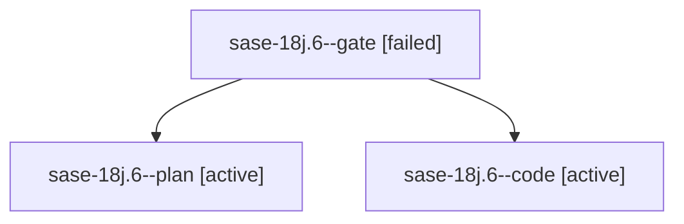

# Family: sase-18j.6

[Agent Hoods](../README.md) / [bbugyi200](../users/bbugyi200/README.md) / [athena](../users/bbugyi200/machines/athena/README.md) / [sase-18j](../users/bbugyi200/machines/athena/hoods/sase-18j/README.md) / sase-18j.6

Owner: `bbugyi200.athena` · Hood: `sase-18j` · Members: 3 · Bead: [sase-18j.6](https://github.com/sase-org/sase--beads/blob/main/pages/sase-18j/sase-18j.6.md)

## Lineage

The diagram is an optional enhancement; the ordered table below contains the same lineage in accessible text.

| Role | Agent | State | Model / provider | Timing | Commits | Prompt | Chat |
|---|---|---|---|---|---:|---|---|
| gate | sase-18j.6--gate | failed | gpt-6-sol / codex | 2026-09-25T14:36:10.197389+00:00 → 2026-09-25T14:37:38.478562+00:00 | 0 | — | [Chat](../agents/bbugyi200.athena.sase-18j.6--gate/chat.md) |
| plan | sase-18j.6--plan | active | gpt-6-sol / codex | 2026-09-25T14:30:30.620187+00:00 | 0 | [Prompt](../agents/bbugyi200.athena.sase-18j.6--plan/prompt.md) | [Chat](../agents/bbugyi200.athena.sase-18j.6--plan/chat.md) |
| code | sase-18j.6--code | active | gpt-5.6-terra / codex | 2026-09-25T14:38:03.337868+00:00 | 0 | — | — |

## Neighbors

| Agent | Relation | State |
|---|---|---|
| [sase-18j.1](../agents/bbugyi200.athena.sase-18j.1/README.md) | sase-18j hood | completed |
| [sase-18j.2](bbugyi200.athena.sase-18j.2.md) (family · 3) | sase-18j hood | completed 2, failed 1 |
| [sase-18j.3](bbugyi200.athena.sase-18j.3.md) (family · 3) | sase-18j hood | completed 2, failed 1 |
| [sase-18j.4](../agents/bbugyi200.athena.sase-18j.4/README.md) | sase-18j hood | completed |
| [sase-18j.5](bbugyi200.athena.sase-18j.5.md) (family · 9) | sase-18j hood | completed 5, failed 4 |
| [sase-18j.7](../agents/bbugyi200.athena.sase-18j.7/README.md) | sase-18j hood | waiting |
| [sase-18j.8](../agents/bbugyi200.athena.sase-18j.8/README.md) | sase-18j hood | waiting |
| [sase-18j.9](../agents/bbugyi200.athena.sase-18j.9/README.md) | sase-18j hood | waiting |
| [sase-18j.land](../agents/bbugyi200.athena.sase-18j.land/README.md) | sase-18j hood | waiting |
