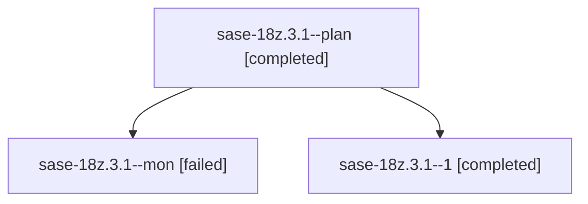

# Family: sase-18z.3.1

[Agent Hoods](../README.md) / [bbugyi200](../users/bbugyi200/README.md) / [athena](../users/bbugyi200/machines/athena/README.md) / [sase-18z](../users/bbugyi200/machines/athena/hoods/sase-18z/README.md) / sase-18z.3.1

Owner: `bbugyi200.athena` · Hood: `sase-18z` · Members: 3 · Bead: [sase-18z.3.1](https://github.com/sase-org/sase--beads/blob/main/pages/sase-18z/sase-18z.3.1.md)

## Lineage

The diagram is an optional enhancement; the ordered table below contains the same lineage in accessible text.

| Role | Agent | State | Model / provider | Timing | Commits | Prompt | Chat |
|---|---|---|---|---|---:|---|---|
| plan | sase-18z.3.1--plan | completed | grok-4.6 / grok | 2026-09-25T15:03:55.369958+00:00 → 2026-09-25T15:25:49.931007+00:00 | 0 | [Prompt](../agents/bbugyi200.athena.sase-18z.3.1--plan/prompt.md) | [Chat](../agents/bbugyi200.athena.sase-18z.3.1--plan/chat.md) |
| mon | sase-18z.3.1--mon | failed | grok-4.6 / grok | 2026-09-25T15:23:56.070221+00:00 → 2026-09-25T15:37:35.709064+00:00 | 0 | — | [Chat](../agents/bbugyi200.athena.sase-18z.3.1--mon/chat.md) |
| 1 | sase-18z.3.1--1 | completed | grok-4.6 / grok | 2026-09-25T15:39:10.431889+00:00 → 2026-09-25T15:49:49.484017+00:00 | [1](../agents/bbugyi200.athena.sase-18z.3.1--1/README.md#commits) | [Prompt](../agents/bbugyi200.athena.sase-18z.3.1--1/prompt.md) | [Chat](../agents/bbugyi200.athena.sase-18z.3.1--1/chat.md) |

## Commits

| Role | Repo | Commit | Subject | Committed |
|---|---|---|---|---|
| 1 | sase | [`204a499`](https://github.com/sase-org/sase/commit/204a4993e298717469eb318410e15bb2b878c2cd) | feat(ace-tui): wrap bead note previews to the visible Context-card width | 2026-09-25 11:45:04 EDT |

## Neighbors

| Agent | Relation | State |
|---|---|---|
| [sase-18z.3.2](../agents/bbugyi200.athena.sase-18z.3.2/README.md) | sase-18z.3 hood | completed |
| [sase-18z.3.land](../agents/bbugyi200.athena.sase-18z.3.land/README.md) | sase-18z.3 hood | active |
| [sase-18z.1](../agents/bbugyi200.athena.sase-18z.1/README.md) | sase-18z hood | completed |
| [sase-18z.2](../agents/bbugyi200.athena.sase-18z.2/README.md) | sase-18z hood | completed |
| [sase-18z.land](bbugyi200.athena.sase-18z.land.md) (family · 3) | sase-18z hood | failed 3 |
