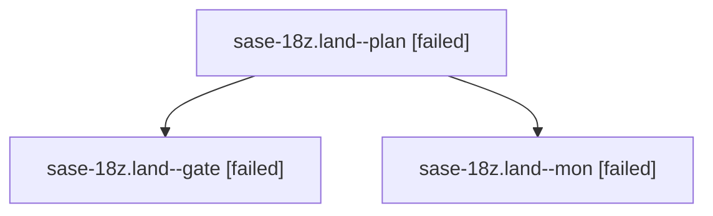

# Family: sase-18z.land

[Agent Hoods](../README.md) / [bbugyi200](../users/bbugyi200/README.md) / [athena](../users/bbugyi200/machines/athena/README.md) / [sase-18z](../users/bbugyi200/machines/athena/hoods/sase-18z/README.md) / sase-18z.land

Owner: `bbugyi200.athena` · Hood: `sase-18z` · Members: 3 · Bead: [sase-18z](https://github.com/sase-org/sase--beads/blob/main/pages/sase-18z/README.md)

## Lineage

The diagram is an optional enhancement; the ordered table below contains the same lineage in accessible text.

| Role | Agent | State | Model / provider | Timing | Commits | Prompt | Chat |
|---|---|---|---|---|---:|---|---|
| plan | sase-18z.land--plan | failed | gpt-6-sol / codex | 2026-09-25T13:59:19.437519+00:00 → 2026-09-25T14:45:35.124111+00:00 | 0 | [Prompt](../agents/bbugyi200.athena.sase-18z.land--plan/prompt.md) | [Chat](../agents/bbugyi200.athena.sase-18z.land--plan/chat.md) |
| gate | sase-18z.land--gate | failed | gpt-6-sol / codex | 2026-09-25T14:43:51.011042+00:00 → 2026-09-25T14:45:22.151726+00:00 | 0 | — | [Chat](../agents/bbugyi200.athena.sase-18z.land--gate/chat.md) |
| mon | sase-18z.land--mon | failed | gpt-6-sol / codex | 2026-09-25T14:45:21.036541+00:00 → 2026-09-25T14:47:12.560566+00:00 | 0 | — | [Chat](../agents/bbugyi200.athena.sase-18z.land--mon/chat.md) |

## Neighbors

| Agent | Relation | State |
|---|---|---|
| [sase-18z.1](../agents/bbugyi200.athena.sase-18z.1/README.md) | sase-18z hood | completed |
| [sase-18z.2](../agents/bbugyi200.athena.sase-18z.2/README.md) | sase-18z hood | completed |
| [sase-18z.3.1](bbugyi200.athena.sase-18z.3.1.md) (family · 3) | sase-18z hood | completed 2, failed 1 |
| [sase-18z.3.2](../agents/bbugyi200.athena.sase-18z.3.2/README.md) | sase-18z hood | completed |
| [sase-18z.3.land](../agents/bbugyi200.athena.sase-18z.3.land/README.md) | sase-18z hood | completed |
