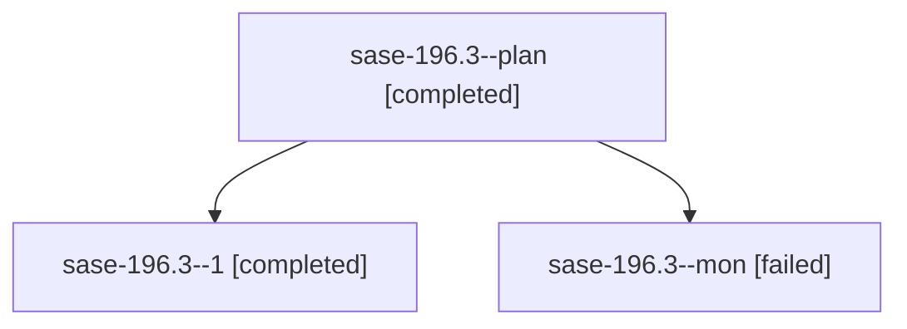

# Family: sase-196.3

[Agent Hoods](../README.md) / [bbugyi200](../users/bbugyi200/README.md) / [athena](../users/bbugyi200/machines/athena/README.md) / [sase-196](../users/bbugyi200/machines/athena/hoods/sase-196/README.md) / sase-196.3

Owner: `bbugyi200.athena` · Hood: `sase-196` · Members: 3 · Bead: [sase-196.3](https://github.com/sase-org/sase--beads/blob/main/pages/sase-196/sase-196.3.md)

## Lineage

The diagram is an optional enhancement; the ordered table below contains the same lineage in accessible text.

| Role | Agent | State | Model / provider | Timing | Commits | Prompt | Chat |
|---|---|---|---|---|---:|---|---|
| plan | sase-196.3--plan | completed | muse-spark-1.3-contributor / muse | 2026-09-25T13:16:59.549734+00:00 → 2026-09-25T13:48:33.047778+00:00 | 0 | [Prompt](../agents/bbugyi200.athena.sase-196.3--plan/prompt.md) | [Chat](../agents/bbugyi200.athena.sase-196.3--plan/chat.md) |
| 1 | sase-196.3--1 | completed | muse-spark-1.3-contributor / muse | 2026-09-25T14:16:38.045151+00:00 → 2026-09-25T14:34:55.394085+00:00 | 0 | [Prompt](../agents/bbugyi200.athena.sase-196.3--1/prompt.md) | [Chat](../agents/bbugyi200.athena.sase-196.3--1/chat.md) |
| mon | sase-196.3--mon | failed | muse-spark-1.3-contributor / muse | 2026-09-25T13:48:00.176574+00:00 → 2026-09-25T14:05:03.269437+00:00 | 0 | — | [Chat](../agents/bbugyi200.athena.sase-196.3--mon/chat.md) |

## Neighbors

| Agent | Relation | State |
|---|---|---|
| [sase-196.1](../agents/bbugyi200.athena.sase-196.1/README.md) | sase-196 hood | completed |
| [sase-196.2](../agents/bbugyi200.athena.sase-196.2/README.md) | sase-196 hood | completed |
| [sase-196.4](../agents/bbugyi200.athena.sase-196.4/README.md) | sase-196 hood | completed |
| [sase-196.5](../agents/bbugyi200.athena.sase-196.5/README.md) | sase-196 hood | completed |
| [sase-196.6.1](../agents/bbugyi200.athena.sase-196.6.1/README.md) | sase-196 hood | active |
| [sase-196.6.2](../agents/bbugyi200.athena.sase-196.6.2/README.md) | sase-196 hood | completed |
| [sase-196.6.land](../agents/bbugyi200.athena.sase-196.6.land/README.md) | sase-196 hood | waiting |
| [sase-196.land](bbugyi200.athena.sase-196.land.md) (family · 3) | sase-196 hood | failed 3 |
