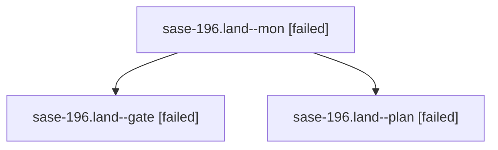

# Family: sase-196.land

[Agent Hoods](../README.md) / [bbugyi200](../users/bbugyi200/README.md) / [athena](../users/bbugyi200/machines/athena/README.md) / [sase-196](../users/bbugyi200/machines/athena/hoods/sase-196/README.md) / sase-196.land

Owner: `bbugyi200.athena` · Hood: `sase-196` · Members: 3 · Bead: [sase-196](https://github.com/sase-org/sase--beads/blob/main/pages/sase-196/README.md)

## Lineage

The diagram is an optional enhancement; the ordered table below contains the same lineage in accessible text.

| Role | Agent | State | Model / provider | Timing | Commits | Prompt | Chat |
|---|---|---|---|---|---:|---|---|
| mon | sase-196.land--mon | failed | gpt-6-sol / codex | 2026-09-25T16:06:18.025484+00:00 → 2026-09-25T16:09:06.572901+00:00 | 0 | — | [Chat](../agents/bbugyi200.athena.sase-196.land--mon/chat.md) |
| gate | sase-196.land--gate | failed | gpt-6-sol / codex | 2026-09-25T16:05:12.831055+00:00 → 2026-09-25T16:06:20.378957+00:00 | 0 | — | [Chat](../agents/bbugyi200.athena.sase-196.land--gate/chat.md) |
| plan | sase-196.land--plan | failed | gpt-6-sol / codex | 2026-09-25T15:49:54.977178+00:00 → 2026-09-25T16:06:47.213316+00:00 | 0 | [Prompt](../agents/bbugyi200.athena.sase-196.land--plan/prompt.md) | [Chat](../agents/bbugyi200.athena.sase-196.land--plan/chat.md) |

## Neighbors

| Agent | Relation | State |
|---|---|---|
| [sase-196.1](../agents/bbugyi200.athena.sase-196.1/README.md) | sase-196 hood | completed |
| [sase-196.2](../agents/bbugyi200.athena.sase-196.2/README.md) | sase-196 hood | completed |
| [sase-196.3](bbugyi200.athena.sase-196.3.md) (family · 3) | sase-196 hood | completed 2, failed 1 |
| [sase-196.4](../agents/bbugyi200.athena.sase-196.4/README.md) | sase-196 hood | completed |
| [sase-196.5](../agents/bbugyi200.athena.sase-196.5/README.md) | sase-196 hood | completed |
| [sase-196.6.1](../agents/bbugyi200.athena.sase-196.6.1/README.md) | sase-196 hood | active |
| [sase-196.6.2](../agents/bbugyi200.athena.sase-196.6.2/README.md) | sase-196 hood | completed |
| [sase-196.6.land](../agents/bbugyi200.athena.sase-196.6.land/README.md) | sase-196 hood | waiting |
