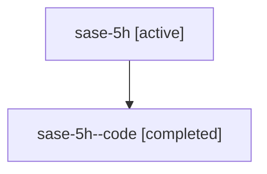

# Family: sase-5h

[Agent Hoods](../README.md) / [bbugyi200](../users/bbugyi200/README.md) / [athena](../users/bbugyi200/machines/athena/README.md) / [sase-5h](../users/bbugyi200/machines/athena/hoods/sase-5h/README.md) / sase-5h

Owner: `bbugyi200.athena` · Hood: `sase-5h` · Members: 2

## Lineage

The diagram is an optional enhancement; the ordered table below contains the same lineage in accessible text.

| Role | Agent | State | Model / provider | Timing | Commits | Prompt | Chat |
|---|---|---|---|---|---:|---|---|
| root | sase-5h | active | claude-fable-5 / claude | 2026-07-07T19:07:20.242003+00:00 | [1](../agents/bbugyi200.athena.sase-5h/README.md#commits) | [Prompt](../agents/bbugyi200.athena.sase-5h/prompt.md) | [Chat](../agents/bbugyi200.athena.sase-5h/chat.md) |
| code | sase-5h--code | completed | gpt-5.5 / codex | 2026-07-07T19:17:40.329365+00:00 | 0 | — | [Chat](../agents/bbugyi200.athena.sase-5h--code/chat.md) |

## Commits

| Role | Repo | Commit | Subject | Committed (UTC) |
|---|---|---|---|---|
| root | sase | [`5449f87`](https://github.com/sase-org/sase/commit/5449f871cdad3c2c1bc80a1feafe1cd7359120d1) | test: close repo completion verification gaps (sase-5h) | 2026-07-07 19:24:45 |

## Neighbors

| Agent | Relation | State |
|---|---|---|
| [sase-5h.1](../agents/bbugyi200.athena.sase-5h.1/README.md) | descendant | active |
| [sase-5h.2](../agents/bbugyi200.athena.sase-5h.2/README.md) | descendant | active |
| [sase-5h.3](../agents/bbugyi200.athena.sase-5h.3/README.md) | descendant | active |
| [sase-5h.4](../agents/bbugyi200.athena.sase-5h.4/README.md) | descendant | active |
| [sase-5h.5](../agents/bbugyi200.athena.sase-5h.5/README.md) | descendant | active |
| [sase-5h.6](../agents/bbugyi200.athena.sase-5h.6/README.md) | descendant | active |
| [sase-5h.6.f1](../agents/bbugyi200.athena.sase-5h.6.f1/README.md) | descendant | active |
| [sase-5h.w1](bbugyi200.athena.sase-5h.w1.md) (family · 2) | descendant | active 2 |
