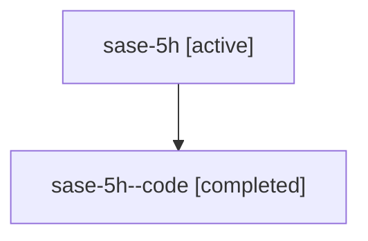

# Family: sase-5h

Owner: `bbugyi200.athena` · Hood: `sase-5h` · Members: 2

## Lineage

The diagram is an optional enhancement; the ordered table below contains the same lineage in accessible text.

| Role | Agent | State | Model / provider | Timing | Commits | Prompt | Chat |
|---|---|---|---|---|---:|---|---|
| root | sase-5h | active | claude-fable-5 / claude | 2026-07-07T19:07:20.242003+00:00 | 1 | [Prompt](../agents/bbugyi200.athena.sase-5h/prompt.md) | [Chat](../agents/bbugyi200.athena.sase-5h/chat.md) |
| code | sase-5h--code | completed | gpt-5.5 / codex | 2026-07-07T19:17:40.329365+00:00 | 0 | — | [Chat](../agents/bbugyi200.athena.sase-5h--code/chat.md) |
