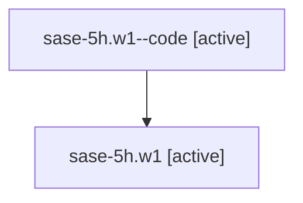

# Family: sase-5h.w1

[Agent Hoods](../README.md) / [bbugyi200](../users/bbugyi200/README.md) / [athena](../users/bbugyi200/machines/athena/README.md) / [sase-5h](../users/bbugyi200/machines/athena/hoods/sase-5h/README.md) / sase-5h.w1

Owner: `bbugyi200.athena` · Hood: `sase-5h` · Members: 2

## Lineage

The diagram is an optional enhancement; the ordered table below contains the same lineage in accessible text.

| Role | Agent | State | Model / provider | Timing | Commits | Prompt | Chat |
|---|---|---|---|---|---:|---|---|
| code | sase-5h.w1--code | active | gpt-5.5 / codex | 2026-07-07T19:36:07.496179+00:00 | 0 | — | — |
| root | sase-5h.w1 | active | claude-fable-5 / claude | 2026-07-07T19:25:46.879331+00:00 | [1](../agents/bbugyi200.athena.sase-5h.w1/README.md#commits) | [Prompt](../agents/bbugyi200.athena.sase-5h.w1/prompt.md) | [Chat](../agents/bbugyi200.athena.sase-5h.w1/chat.md) |

## Commits

| Role | Repo | Commit | Subject | Committed (UTC) |
|---|---|---|---|---|
| root | sase | [`b3db87d`](https://github.com/sase-org/sase/commit/b3db87d93c7ddd23d415ae6ef10d3275379b8886) | chore: Add SDD prompt and plan for vcs\_ref\_colon\_completion | 2026-07-07 19:36:06 |

## Neighbors

| Agent | Relation | State |
|---|---|---|
| [sase-5h](bbugyi200.athena.sase-5h.md) (family · 2) | ancestor | active 1, completed 1 |
| [sase-5h.1](../agents/bbugyi200.athena.sase-5h.1/README.md) | sase-5h hood | active |
| [sase-5h.2](../agents/bbugyi200.athena.sase-5h.2/README.md) | sase-5h hood | active |
| [sase-5h.3](../agents/bbugyi200.athena.sase-5h.3/README.md) | sase-5h hood | active |
| [sase-5h.4](../agents/bbugyi200.athena.sase-5h.4/README.md) | sase-5h hood | active |
| [sase-5h.5](../agents/bbugyi200.athena.sase-5h.5/README.md) | sase-5h hood | active |
| [sase-5h.6](../agents/bbugyi200.athena.sase-5h.6/README.md) | sase-5h hood | active |
| [sase-5h.6.f1](../agents/bbugyi200.athena.sase-5h.6.f1/README.md) | sase-5h hood | active |
