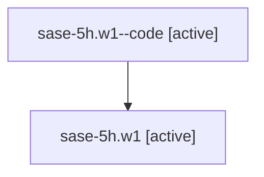

# Family: sase-5h.w1

Owner: `bbugyi200.athena` · Hood: `sase-5h` · Members: 2

## Lineage

The diagram is an optional enhancement; the ordered table below contains the same lineage in accessible text.

| Role | Agent | State | Model / provider | Timing | Commits | Prompt | Chat |
|---|---|---|---|---|---:|---|---|
| code | sase-5h.w1--code | active | gpt-5.5 / codex | 2026-07-07T19:36:07.496179+00:00 | 0 | — | — |
| root | sase-5h.w1 | active | claude-fable-5 / claude | 2026-07-07T19:25:46.879331+00:00 | 1 | [Prompt](../agents/bbugyi200.athena.sase-5h.w1/prompt.md) | [Chat](../agents/bbugyi200.athena.sase-5h.w1/chat.md) |
