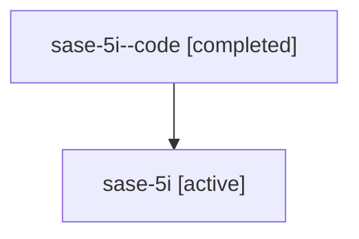

# Family: sase-5i

[Agent Hoods](../README.md) / [bbugyi200](../users/bbugyi200/README.md) / [athena](../users/bbugyi200/machines/athena/README.md) / [sase-5i](../users/bbugyi200/machines/athena/hoods/sase-5i/README.md) / sase-5i

Owner: `bbugyi200.athena` · Hood: `sase-5i` · Members: 2

## Lineage

The diagram is an optional enhancement; the ordered table below contains the same lineage in accessible text.

| Role | Agent | State | Model / provider | Timing | Commits | Prompt | Chat |
|---|---|---|---|---|---:|---|---|
| code | sase-5i--code | completed | gpt-5.5 / codex | 2026-07-07T22:01:47.854404+00:00 | 0 | — | [Chat](../agents/bbugyi200.athena.sase-5i--code/chat.md) |
| root | sase-5i | active | claude-fable-5 / claude | 2026-07-07T21:48:16.774820+00:00 | [2](../agents/bbugyi200.athena.sase-5i/README.md#commits) | [Prompt](../agents/bbugyi200.athena.sase-5i/prompt.md) | [Chat](../agents/bbugyi200.athena.sase-5i/chat.md) |

## Commits

| Role | Commit | Subject | Committed (UTC) |
|---|---|---|---|
| root | [`1a73a30`](https://github.com/sase-org/sase/commit/1a73a30c9b5e805d4ba4e834878f4b3fc3ecf02b) | chore: Add SDD prompt and plan for close\_sase\_5i\_parity\_and\_test\_gaps (sase-5i) | 2026-07-07 22:01:45 |
| root | [`b596d78`](https://github.com/sase-org/sase/commit/b596d78dbbcd9d93712a11332a6078e59723efb7) | fix: align VCS ref completion parity (sase-5i) | 2026-07-07 22:23:03 |

## Neighbors

| Agent | Relation | State |
|---|---|---|
| [sase-5i.1](../agents/bbugyi200.athena.sase-5i.1/README.md) | descendant | active |
| [sase-5i.2](../agents/bbugyi200.athena.sase-5i.2/README.md) | descendant | active |
| [sase-5i.3](../agents/bbugyi200.athena.sase-5i.3/README.md) | descendant | active |
| [sase-5i.4](../agents/bbugyi200.athena.sase-5i.4/README.md) | descendant | active |
| [sase-5i.5](../agents/bbugyi200.athena.sase-5i.5/README.md) | descendant | active |
| [sase-5i.6](../agents/bbugyi200.athena.sase-5i.6/README.md) | descendant | active |
