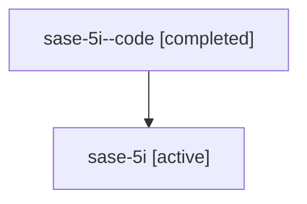

# Family: sase-5i

Owner: `bbugyi200.athena` · Hood: `sase-5i` · Members: 2

## Lineage

The diagram is an optional enhancement; the ordered table below contains the same lineage in accessible text.

| Role | Agent | State | Model / provider | Timing | Commits | Prompt | Chat |
|---|---|---|---|---|---:|---|---|
| code | sase-5i--code | completed | gpt-5.5 / codex | 2026-07-07T22:01:47.854404+00:00 | 0 | — | [Chat](../agents/bbugyi200.athena.sase-5i--code/chat.md) |
| root | sase-5i | active | claude-fable-5 / claude | 2026-07-07T21:48:16.774820+00:00 | 2 | [Prompt](../agents/bbugyi200.athena.sase-5i/prompt.md) | [Chat](../agents/bbugyi200.athena.sase-5i/chat.md) |
