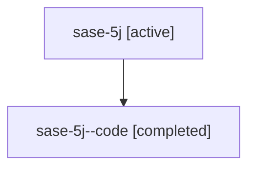

# Family: sase-5j

Owner: `bbugyi200.athena` · Hood: `sase-5j` · Members: 2

## Lineage

The diagram is an optional enhancement; the ordered table below contains the same lineage in accessible text.

| Role | Agent | State | Model / provider | Timing | Commits | Prompt | Chat |
|---|---|---|---|---|---:|---|---|
| root | sase-5j | active | opus / claude | 2026-07-08T06:35:32.287566+00:00 | 2 | [Prompt](../agents/bbugyi200.athena.sase-5j/prompt.md) | [Chat](../agents/bbugyi200.athena.sase-5j/chat.md) |
| code | sase-5j--code | completed | gpt-5.5 / codex | 2026-07-08T06:47:12.536942+00:00 | 1 | — | [Chat](../agents/bbugyi200.athena.sase-5j--code/chat.md) |
