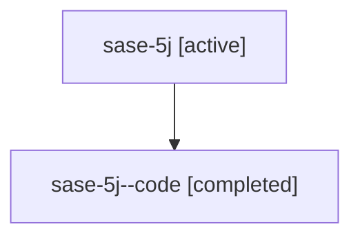

# Family: sase-5j

[Agent Hoods](../README.md) / [bbugyi200](../users/bbugyi200/README.md) / [athena](../users/bbugyi200/machines/athena/README.md) / [sase-5j](../users/bbugyi200/machines/athena/hoods/sase-5j/README.md) / sase-5j

Owner: `bbugyi200.athena` · Hood: `sase-5j` · Members: 2

## Lineage

The diagram is an optional enhancement; the ordered table below contains the same lineage in accessible text.

| Role | Agent | State | Model / provider | Timing | Commits | Prompt | Chat |
|---|---|---|---|---|---:|---|---|
| root | sase-5j | active | opus / claude | 2026-07-08T06:35:32.287566+00:00 | [2](../agents/bbugyi200.athena.sase-5j/README.md#commits) | [Prompt](../agents/bbugyi200.athena.sase-5j/prompt.md) | [Chat](../agents/bbugyi200.athena.sase-5j/chat.md) |
| code | sase-5j--code | completed | gpt-5.5 / codex | 2026-07-08T06:47:12.536942+00:00 | [1](../agents/bbugyi200.athena.sase-5j--code/README.md#commits) | — | [Chat](../agents/bbugyi200.athena.sase-5j--code/chat.md) |

## Commits

| Role | Commit | Subject | Committed (UTC) |
|---|---|---|---|
| root | [`bb46c64`](https://github.com/sase-org/sase/commit/bb46c640baa116f6e8732cfd7ec4718dfd45cc32) | chore: Add SDD prompt and plan for sase\_5j\_finish | 2026-07-08 06:47:11 |
| code | [`bbbcf31`](https://github.com/sase-org/sase/commit/bbbcf31fd96f74fcd8e5328cf9b486de3960e34e) | fix(sdd): point missing companion stores at migrate | 2026-07-08 06:58:58 |
| root | [`bbbcf31`](https://github.com/sase-org/sase/commit/bbbcf31fd96f74fcd8e5328cf9b486de3960e34e) | fix(sdd): point missing companion stores at migrate | 2026-07-08 06:58:58 |

## Neighbors

| Agent | Relation | State |
|---|---|---|
| [sase-5j.1](../agents/bbugyi200.athena.sase-5j.1/README.md) | descendant | active |
| [sase-5j.2](../agents/bbugyi200.athena.sase-5j.2/README.md) | descendant | active |
| [sase-5j.3](../agents/bbugyi200.athena.sase-5j.3/README.md) | descendant | active |
| [sase-5j.4](../agents/bbugyi200.athena.sase-5j.4/README.md) | descendant | active |
| [sase-5j.5](../agents/bbugyi200.athena.sase-5j.5/README.md) | descendant | active |
| [sase-5j.6](../agents/bbugyi200.athena.sase-5j.6/README.md) | descendant | active |
| [sase-5j.f1](../agents/bbugyi200.athena.sase-5j.f1/README.md) | descendant | waiting |
| [sase-5j.f1.f1](../agents/bbugyi200.athena.sase-5j.f1.f1/README.md) | descendant | waiting |
