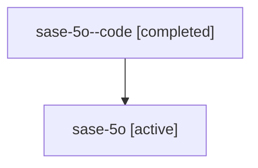

# Family: sase-5o

[Agent Hoods](../README.md) / [bbugyi200](../users/bbugyi200/README.md) / [athena](../users/bbugyi200/machines/athena/README.md) / [sase-5o](../users/bbugyi200/machines/athena/hoods/sase-5o/README.md) / sase-5o

Owner: `bbugyi200.athena` · Hood: `sase-5o` · Members: 2

## Lineage

The diagram is an optional enhancement; the ordered table below contains the same lineage in accessible text.

| Role | Agent | State | Model / provider | Timing | Commits | Prompt | Chat |
|---|---|---|---|---|---:|---|---|
| code | sase-5o--code | completed | gpt-5.6-sol / codex | 2026-07-10T22:55:22.591106+00:00 | 0 | — | [Chat](../agents/bbugyi200.athena.sase-5o--code/chat.md) |
| root | sase-5o | active | claude-fable-5 / claude | 2026-07-10T22:34:45.135065+00:00 | [1](../agents/bbugyi200.athena.sase-5o/README.md#commits) | [Prompt](../agents/bbugyi200.athena.sase-5o/prompt.md) | [Chat](../agents/bbugyi200.athena.sase-5o/chat.md) |

## Commits

| Role | Repo | Commit | Subject | Committed |
|---|---|---|---|---|
| root | sase | [`a035958`](https://github.com/sase-org/sase/commit/a035958ca96d7ab80a47f18a944c384b90291f67) | test(fakey): guard retry marker attribution (sase-5o) | 2026-07-10 19:01:23 EDT |

## Neighbors

| Agent | Relation | State |
|---|---|---|
| [sase-5o.1](../agents/bbugyi200.athena.sase-5o.1/README.md) | descendant | active |
| [sase-5o.2](../agents/bbugyi200.athena.sase-5o.2/README.md) | descendant | active |
| [sase-5o.3](../agents/bbugyi200.athena.sase-5o.3/README.md) | descendant | active |
| [sase-5o.4](../agents/bbugyi200.athena.sase-5o.4/README.md) | descendant | active |
| [sase-5o.5](../agents/bbugyi200.athena.sase-5o.5/README.md) | descendant | active |
