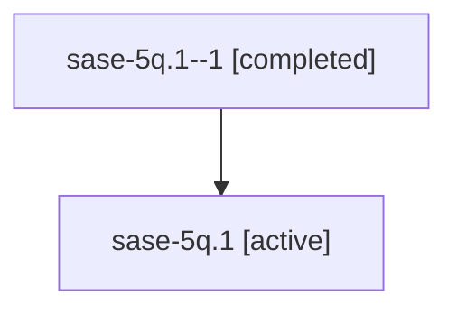

# Family: sase-5q.1

Owner: `bbugyi200.athena` · Hood: `sase-5q` · Members: 2

## Lineage

The diagram is an optional enhancement; the ordered table below contains the same lineage in accessible text.

| Role | Agent | State | Model / provider | Timing | Commits | Prompt | Chat |
|---|---|---|---|---|---:|---|---|
| 1 | sase-5q.1--1 | completed | gpt-5.6-sol / codex | 2026-07-11T23:31:33.544893+00:00 | 0 | — | [Chat](../agents/bbugyi200.athena.sase-5q.1--1/chat.md) |
| root | sase-5q.1 | active | gpt-5.6-sol / codex | 2026-07-11T23:17:27.489280+00:00 | 2 | [Prompt](../agents/bbugyi200.athena.sase-5q.1/prompt.md) | [Chat](../agents/bbugyi200.athena.sase-5q.1/chat.md) |
