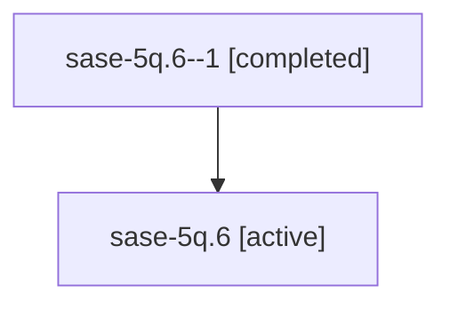

# Family: sase-5q.6

[Agent Hoods](../README.md) / [bbugyi200](../users/bbugyi200/README.md) / [athena](../users/bbugyi200/machines/athena/README.md) / [sase-5q](../users/bbugyi200/machines/athena/hoods/sase-5q/README.md) / sase-5q.6

Owner: `bbugyi200.athena` · Hood: `sase-5q` · Members: 2

## Lineage

The diagram is an optional enhancement; the ordered table below contains the same lineage in accessible text.

| Role | Agent | State | Model / provider | Timing | Commits | Prompt | Chat |
|---|---|---|---|---|---:|---|---|
| 1 | sase-5q.6--1 | completed | gpt-5.6-sol / codex | 2026-07-12T01:26:41.512881+00:00 | 0 | — | [Chat](../agents/bbugyi200.athena.sase-5q.6--1/chat.md) |
| root | sase-5q.6 | active | gpt-5.6-sol / codex | 2026-07-12T01:02:34.435853+00:00 | 0 | [Prompt](../agents/bbugyi200.athena.sase-5q.6/prompt.md) | [Chat](../agents/bbugyi200.athena.sase-5q.6/chat.md) |

## Neighbors

| Agent | Relation | State |
|---|---|---|
| [sase-5q](bbugyi200.athena.sase-5q.md) (family · 1) | ancestor | active 1 |
| [sase-5q.1](bbugyi200.athena.sase-5q.1.md) (family · 2) | sase-5q hood | active 1, completed 1 |
| [sase-5q.2](../agents/bbugyi200.athena.sase-5q.2/README.md) | sase-5q hood | active |
| [sase-5q.3](../agents/bbugyi200.athena.sase-5q.3/README.md) | sase-5q hood | active |
| [sase-5q.4](../agents/bbugyi200.athena.sase-5q.4/README.md) | sase-5q hood | active |
| [sase-5q.5](../agents/bbugyi200.athena.sase-5q.5/README.md) | sase-5q hood | active |
| [sase-5q.7](../agents/bbugyi200.athena.sase-5q.7/README.md) | sase-5q hood | active |
