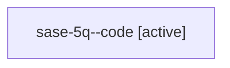

# Family: sase-5q

[Agent Hoods](../README.md) / [bbugyi200](../users/bbugyi200/README.md) / [athena](../users/bbugyi200/machines/athena/README.md) / [sase-5q](../users/bbugyi200/machines/athena/hoods/sase-5q/README.md) / sase-5q

Owner: `bbugyi200.athena` · Hood: `sase-5q` · Members: 1 · Bead: [sase-5q](https://github.com/sase-org/sase--beads/blob/main/pages/sase-5q/README.md)

## Lineage

The diagram is an optional enhancement; the ordered table below contains the same lineage in accessible text.

| Role | Agent | State | Model / provider | Timing | Commits | Prompt | Chat |
|---|---|---|---|---|---:|---|---|
| code | sase-5q--code | active | gpt-5.6-sol / codex | 2026-07-12T02:26:01.345672+00:00 | 0 | — | — |

## Neighbors

| Agent | Relation | State |
|---|---|---|
| [sase-5q.1](bbugyi200.athena.sase-5q.1.md) (family · 2) | descendant | active 1, completed 1 |
| [sase-5q.2](../agents/bbugyi200.athena.sase-5q.2/README.md) | descendant | active |
| [sase-5q.3](../agents/bbugyi200.athena.sase-5q.3/README.md) | descendant | active |
| [sase-5q.4](../agents/bbugyi200.athena.sase-5q.4/README.md) | descendant | active |
| [sase-5q.5](../agents/bbugyi200.athena.sase-5q.5/README.md) | descendant | active |
| [sase-5q.6](bbugyi200.athena.sase-5q.6.md) (family · 2) | descendant | active 1, completed 1 |
| [sase-5q.7](../agents/bbugyi200.athena.sase-5q.7/README.md) | descendant | active |
