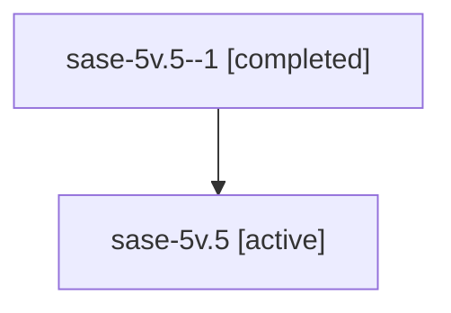

# Family: sase-5v.5

Owner: `bbugyi200.athena` · Hood: `sase-5v` · Members: 2

## Lineage

The diagram is an optional enhancement; the ordered table below contains the same lineage in accessible text.

| Role | Agent | State | Model / provider | Timing | Commits | Prompt | Chat |
|---|---|---|---|---|---:|---|---|
| 1 | sase-5v.5--1 | completed | gpt-5.6-sol / codex | 2026-07-13T10:38:16.626658+00:00 | 0 | — | [Chat](../agents/bbugyi200.athena.sase-5v.5--1/chat.md) |
| root | sase-5v.5 | active | gpt-5.6-sol / codex | 2026-07-13T00:03:32.943841+00:00 | 0 | [Prompt](../agents/bbugyi200.athena.sase-5v.5/prompt.md) | [Chat](../agents/bbugyi200.athena.sase-5v.5/chat.md) |
