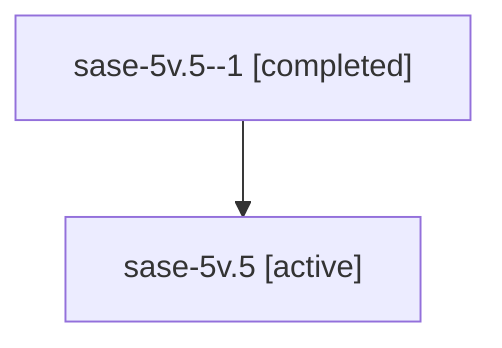

# Family: sase-5v.5

[Agent Hoods](../README.md) / [bbugyi200](../users/bbugyi200/README.md) / [athena](../users/bbugyi200/machines/athena/README.md) / [sase-5v](../users/bbugyi200/machines/athena/hoods/sase-5v/README.md) / sase-5v.5

Owner: `bbugyi200.athena` · Hood: `sase-5v` · Members: 2

## Lineage

The diagram is an optional enhancement; the ordered table below contains the same lineage in accessible text.

| Role | Agent | State | Model / provider | Timing | Commits | Prompt | Chat |
|---|---|---|---|---|---:|---|---|
| 1 | sase-5v.5--1 | completed | gpt-5.6-sol / codex | 2026-07-13T10:38:16.626658+00:00 | 0 | — | [Chat](../agents/bbugyi200.athena.sase-5v.5--1/chat.md) |
| root | sase-5v.5 | active | gpt-5.6-sol / codex | 2026-07-13T00:03:32.943841+00:00 | 0 | [Prompt](../agents/bbugyi200.athena.sase-5v.5/prompt.md) | [Chat](../agents/bbugyi200.athena.sase-5v.5/chat.md) |

## Neighbors

| Agent | Relation | State |
|---|---|---|
| [sase-5v](bbugyi200.athena.sase-5v.md) (family · 3) | ancestor | active 3 |
| [sase-5v.1](../agents/bbugyi200.athena.sase-5v.1/README.md) | sase-5v hood | active |
| [sase-5v.2](../agents/bbugyi200.athena.sase-5v.2/README.md) | sase-5v hood | active |
| [sase-5v.3](../agents/bbugyi200.athena.sase-5v.3/README.md) | sase-5v hood | active |
| [sase-5v.4](../agents/bbugyi200.athena.sase-5v.4/README.md) | sase-5v hood | active |
| [sase-5v.6](../agents/bbugyi200.athena.sase-5v.6/README.md) | sase-5v hood | active |
| [sase-5v.7](../agents/bbugyi200.athena.sase-5v.7/README.md) | sase-5v hood | active |
