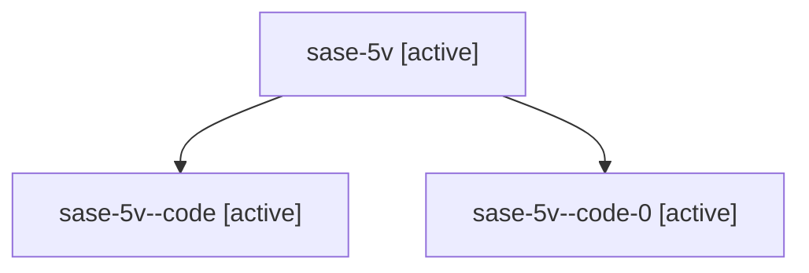

# Family: sase-5v

Owner: `bbugyi200.athena` · Hood: `sase-5v` · Members: 3

## Lineage

The diagram is an optional enhancement; the ordered table below contains the same lineage in accessible text.

| Role | Agent | State | Model / provider | Timing | Commits | Prompt | Chat |
|---|---|---|---|---|---:|---|---|
| root | sase-5v | active | claude-fable-5 / claude | 2026-07-13T10:58:50.316456+00:00 | 1 | [Prompt](../agents/bbugyi200.athena.sase-5v/prompt.md) | [Chat](../agents/bbugyi200.athena.sase-5v/chat.md) |
| code | sase-5v--code | active | gpt-5.6-sol / codex | 2026-07-13T11:05:21.399225+00:00 | 0 | — | [Chat](../agents/bbugyi200.athena.sase-5v--code/chat.md) |
| code-0 | sase-5v--code-0 | active | gpt-5.6-sol / codex | 2026-07-13T11:07:02.570430+00:00 | 0 | — | — |
