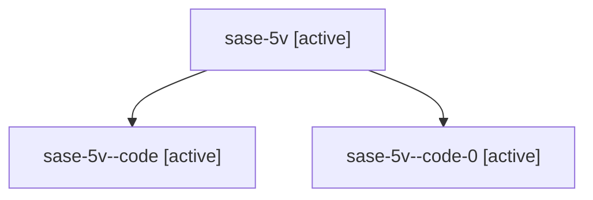

# Family: sase-5v

[Agent Hoods](../README.md) / [bbugyi200](../users/bbugyi200/README.md) / [athena](../users/bbugyi200/machines/athena/README.md) / [sase-5v](../users/bbugyi200/machines/athena/hoods/sase-5v/README.md) / sase-5v

Owner: `bbugyi200.athena` · Hood: `sase-5v` · Members: 3 · Bead: [sase-5v](https://github.com/sase-org/sase--beads/blob/main/pages/sase-5v/README.md)

## Lineage

The diagram is an optional enhancement; the ordered table below contains the same lineage in accessible text.

| Role | Agent | State | Model / provider | Timing | Commits | Prompt | Chat |
|---|---|---|---|---|---:|---|---|
| root | sase-5v | active | claude-fable-5 / claude | 2026-07-13T10:58:50.316456+00:00 | 0 | [Prompt](../agents/bbugyi200.athena.sase-5v/prompt.md) | [Chat](../agents/bbugyi200.athena.sase-5v/chat.md) |
| code | sase-5v--code | active | gpt-5.6-sol / codex | 2026-07-13T11:05:21.399225+00:00 | 0 | — | [Chat](../agents/bbugyi200.athena.sase-5v--code/chat.md) |
| code-0 | sase-5v--code-0 | active | gpt-5.6-sol / codex | 2026-07-13T11:07:02.570430+00:00 | [1](../agents/bbugyi200.athena.sase-5v--code-0/README.md#commits) | — | — |

## Commits

| Role | Repo | Commit | Subject | Committed |
|---|---|---|---|---|
| code-0 | sase | [`d6b6ab7`](https://github.com/sase-org/sase/commit/d6b6ab73f53bb19b6f4f46b4bf275a1abacab753) | docs: document basher vendoring workflow (sase-5v) | 2026-07-13 11:16:11 UTC |

## Neighbors

| Agent | Relation | State |
|---|---|---|
| [sase-5v.1](../agents/bbugyi200.athena.sase-5v.1/README.md) | descendant | active |
| [sase-5v.2](../agents/bbugyi200.athena.sase-5v.2/README.md) | descendant | active |
| [sase-5v.3](../agents/bbugyi200.athena.sase-5v.3/README.md) | descendant | active |
| [sase-5v.4](../agents/bbugyi200.athena.sase-5v.4/README.md) | descendant | active |
| [sase-5v.5](bbugyi200.athena.sase-5v.5.md) (family · 2) | descendant | active 1, completed 1 |
| [sase-5v.6](../agents/bbugyi200.athena.sase-5v.6/README.md) | descendant | active |
| [sase-5v.7](../agents/bbugyi200.athena.sase-5v.7/README.md) | descendant | active |
