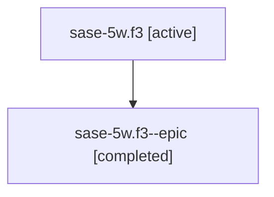

# Family: sase-5w.f3

[Agent Hoods](../README.md) / [bbugyi200](../users/bbugyi200/README.md) / [athena](../users/bbugyi200/machines/athena/README.md) / [sase-5w](../users/bbugyi200/machines/athena/hoods/sase-5w/README.md) / sase-5w.f3

Owner: `bbugyi200.athena` · Hood: `sase-5w` · Members: 2

## Lineage

The diagram is an optional enhancement; the ordered table below contains the same lineage in accessible text.

| Role | Agent | State | Model / provider | Timing | Commits | Prompt | Chat |
|---|---|---|---|---|---:|---|---|
| root | sase-5w.f3 | active | claude-fable-5 / claude | 2026-07-13T17:55:04.379530+00:00 | 0 | [Prompt](../agents/bbugyi200.athena.sase-5w.f3/prompt.md) | [Chat](../agents/bbugyi200.athena.sase-5w.f3/chat.md) |
| epic | sase-5w.f3--epic | completed | gpt-5.6-sol / codex | 2026-07-13T18:11:09.617568+00:00 | 0 | — | [Chat](../agents/bbugyi200.athena.sase-5w.f3--epic/chat.md) |

## Neighbors

| Agent | Relation | State |
|---|---|---|
| [sase-5w](../agents/bbugyi200.athena.sase-5w/README.md) | ancestor | active |
| [sase-5w.1](../agents/bbugyi200.athena.sase-5w.1/README.md) | sase-5w hood | active |
| [sase-5w.2](../agents/bbugyi200.athena.sase-5w.2/README.md) | sase-5w hood | active |
| [sase-5w.3](../agents/bbugyi200.athena.sase-5w.3/README.md) | sase-5w hood | active |
| [sase-5w.4](../agents/bbugyi200.athena.sase-5w.4/README.md) | sase-5w hood | active |
| [sase-5w.5](../agents/bbugyi200.athena.sase-5w.5/README.md) | sase-5w hood | active |
| [sase-5w.6](../agents/bbugyi200.athena.sase-5w.6/README.md) | sase-5w hood | active |
| [sase-5w.f0](../agents/bbugyi200.athena.sase-5w.f0/README.md) | sase-5w hood | waiting |
| [sase-5w.f1](../agents/bbugyi200.athena.sase-5w.f1/README.md) | sase-5w hood | waiting |
| [sase-5w.f2](../agents/bbugyi200.athena.sase-5w.f2/README.md) | sase-5w hood | active |
