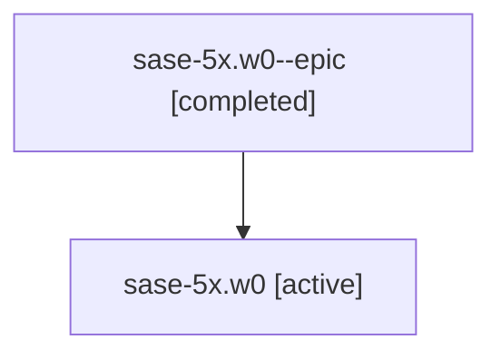

# Family: sase-5x.w0

[Agent Hoods](../README.md) / [bbugyi200](../users/bbugyi200/README.md) / [athena](../users/bbugyi200/machines/athena/README.md) / [sase-5x](../users/bbugyi200/machines/athena/hoods/sase-5x/README.md) / sase-5x.w0

Owner: `bbugyi200.athena` · Hood: `sase-5x` · Members: 2

## Lineage

The diagram is an optional enhancement; the ordered table below contains the same lineage in accessible text.

| Role | Agent | State | Model / provider | Timing | Commits | Prompt | Chat |
|---|---|---|---|---|---:|---|---|
| epic | sase-5x.w0--epic | completed | gpt-5.6-sol / codex | 2026-07-13T20:55:00.118186+00:00 | 0 | — | [Chat](../agents/bbugyi200.athena.sase-5x.w0--epic/chat.md) |
| root | sase-5x.w0 | active | claude-fable-5 / claude | 2026-07-13T20:16:35.384221+00:00 | 0 | [Prompt](../agents/bbugyi200.athena.sase-5x.w0/prompt.md) | [Chat](../agents/bbugyi200.athena.sase-5x.w0/chat.md) |

## Neighbors

| Agent | Relation | State |
|---|---|---|
| [sase-5x](../agents/bbugyi200.athena.sase-5x/README.md) | ancestor | active |
| [sase-5x.1](../agents/bbugyi200.athena.sase-5x.1/README.md) | sase-5x hood | active |
| [sase-5x.2](../agents/bbugyi200.athena.sase-5x.2/README.md) | sase-5x hood | active |
| [sase-5x.3](../agents/bbugyi200.athena.sase-5x.3/README.md) | sase-5x hood | active |
| [sase-5x.4](../agents/bbugyi200.athena.sase-5x.4/README.md) | sase-5x hood | active |
