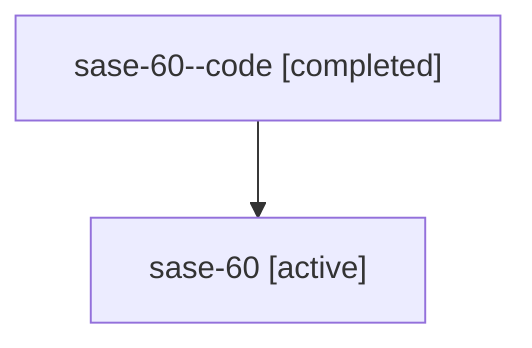

# Family: sase-60

[Agent Hoods](../README.md) / [bbugyi200](../users/bbugyi200/README.md) / [athena](../users/bbugyi200/machines/athena/README.md) / [sase-60](../users/bbugyi200/machines/athena/hoods/sase-60/README.md) / sase-60

Owner: `bbugyi200.athena` · Hood: `sase-60` · Members: 2 · Bead: [sase-60](https://github.com/sase-org/sase--beads/blob/main/pages/sase-60/README.md)

## Lineage

The diagram is an optional enhancement; the ordered table below contains the same lineage in accessible text.

| Role | Agent | State | Model / provider | Timing | Commits | Prompt | Chat |
|---|---|---|---|---|---:|---|---|
| code | sase-60--code | completed | gpt-5.6-sol / codex | 2026-07-14T17:02:12.266726+00:00 | [1](../agents/bbugyi200.athena.sase-60--code/README.md#commits) | — | [Chat](../agents/bbugyi200.athena.sase-60--code/chat.md) |
| root | sase-60 | active | claude-fable-5 / claude | 2026-07-14T16:43:59.657724+00:00 | 0 | [Prompt](../agents/bbugyi200.athena.sase-60/prompt.md) | [Chat](../agents/bbugyi200.athena.sase-60/chat.md) |

## Commits

| Role | Repo | Commit | Subject | Committed |
|---|---|---|---|---|
| code | sase | [`1e3ab66`](https://github.com/sase-org/sase/commit/1e3ab66b5a04aa87350801f993fc98c6fe422eed) | fix: preserve sidecar identity during repository cutover | 2026-07-14 13:18:11 EDT |

## Neighbors

| Agent | Relation | State |
|---|---|---|
| [sase-60.1](../agents/bbugyi200.athena.sase-60.1/README.md) | descendant | active |
| [sase-60.2](../agents/bbugyi200.athena.sase-60.2/README.md) | descendant | active |
| [sase-60.3](../agents/bbugyi200.athena.sase-60.3/README.md) | descendant | active |
| [sase-60.4](../agents/bbugyi200.athena.sase-60.4/README.md) | descendant | active |
| [sase-60.5](../agents/bbugyi200.athena.sase-60.5/README.md) | descendant | active |
