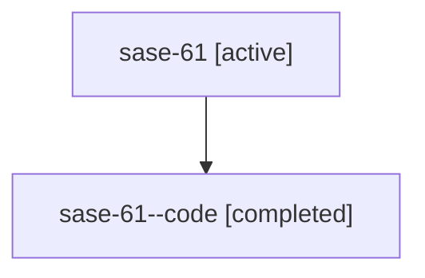

# Family: sase-61

[Agent Hoods](../README.md) / [bbugyi200](../users/bbugyi200/README.md) / [athena](../users/bbugyi200/machines/athena/README.md) / [sase-61](../users/bbugyi200/machines/athena/hoods/sase-61/README.md) / sase-61

Owner: `bbugyi200.athena` · Hood: `sase-61` · Members: 2

## Lineage

The diagram is an optional enhancement; the ordered table below contains the same lineage in accessible text.

| Role | Agent | State | Model / provider | Timing | Commits | Prompt | Chat |
|---|---|---|---|---|---:|---|---|
| root | sase-61 | active | claude-fable-5 / claude | 2026-07-14T18:35:48.186023+00:00 | [1](../agents/bbugyi200.athena.sase-61/README.md#commits) | [Prompt](../agents/bbugyi200.athena.sase-61/prompt.md) | [Chat](../agents/bbugyi200.athena.sase-61/chat.md) |
| code | sase-61--code | completed | gpt-5.6-sol / codex | 2026-07-14T18:53:13.397983+00:00 | 0 | — | [Chat](../agents/bbugyi200.athena.sase-61--code/chat.md) |

## Commits

| Role | Repo | Commit | Subject | Committed |
|---|---|---|---|---|
| root | sase | [`beeefa6`](https://github.com/sase-org/sase/commit/beeefa6c2b358bf36a79f172d2274e13275d9afe) | fix: require plan validation core bindings (sase-61) | 2026-07-14 15:12:17 EDT |

## Neighbors

| Agent | Relation | State |
|---|---|---|
| [sase-61.1](../agents/bbugyi200.athena.sase-61.1/README.md) | descendant | active |
| [sase-61.2](../agents/bbugyi200.athena.sase-61.2/README.md) | descendant | active |
| [sase-61.3](../agents/bbugyi200.athena.sase-61.3/README.md) | descendant | active |
| [sase-61.4](../agents/bbugyi200.athena.sase-61.4/README.md) | descendant | active |
| [sase-61.5](../agents/bbugyi200.athena.sase-61.5/README.md) | descendant | active |
| [sase-61.6](../agents/bbugyi200.athena.sase-61.6/README.md) | descendant | active |
