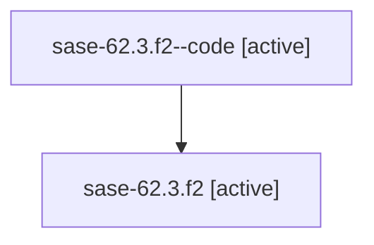

# Family: sase-62.3.f2

Owner: `bbugyi200.athena` · Hood: `sase-62` · Members: 2

## Lineage

The diagram is an optional enhancement; the ordered table below contains the same lineage in accessible text.

| Role | Agent | State | Model / provider | Timing | Commits | Prompt | Chat |
|---|---|---|---|---|---:|---|---|
| code | sase-62.3.f2--code | active | gpt-5.6-sol / codex | 2026-07-15T13:57:08.645264+00:00 | 0 | — | — |
| root | sase-62.3.f2 | active | claude-fable-5 / claude | 2026-07-15T13:39:04.362663+00:00 | 0 | [Prompt](../agents/bbugyi200.athena.sase-62.3.f2/prompt.md) | [Chat](../agents/bbugyi200.athena.sase-62.3.f2/chat.md) |
