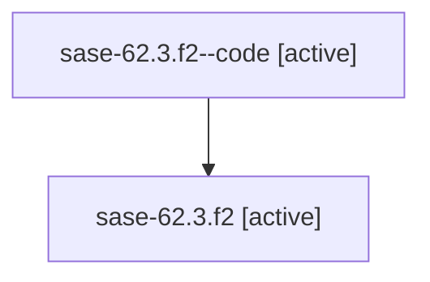

# Family: sase-62.3.f2

[Agent Hoods](../README.md) / [bbugyi200](../users/bbugyi200/README.md) / [athena](../users/bbugyi200/machines/athena/README.md) / [sase-62](../users/bbugyi200/machines/athena/hoods/sase-62/README.md) / sase-62.3.f2

Owner: `bbugyi200.athena` · Hood: `sase-62` · Members: 2

## Lineage

The diagram is an optional enhancement; the ordered table below contains the same lineage in accessible text.

| Role | Agent | State | Model / provider | Timing | Commits | Prompt | Chat |
|---|---|---|---|---|---:|---|---|
| code | sase-62.3.f2--code | active | gpt-5.6-sol / codex | 2026-07-15T13:57:08.645264+00:00 | 0 | — | — |
| root | sase-62.3.f2 | active | claude-fable-5 / claude | 2026-07-15T13:39:04.362663+00:00 | 0 | [Prompt](../agents/bbugyi200.athena.sase-62.3.f2/prompt.md) | [Chat](../agents/bbugyi200.athena.sase-62.3.f2/chat.md) |

## Neighbors

| Agent | Relation | State |
|---|---|---|
| [sase-62.3](../agents/bbugyi200.athena.sase-62.3/README.md) | ancestor | active |
| [sase-62](../agents/bbugyi200.athena.sase-62/README.md) | ancestor | active |
| [sase-62.3.f0](../agents/bbugyi200.athena.sase-62.3.f0/README.md) | sase-62.3 hood | active |
| [sase-62.3.f1](../agents/bbugyi200.athena.sase-62.3.f1/README.md) | sase-62.3 hood | active |
| [sase-62.1](../agents/bbugyi200.athena.sase-62.1/README.md) | sase-62 hood | active |
| [sase-62.2](../agents/bbugyi200.athena.sase-62.2/README.md) | sase-62 hood | active |
