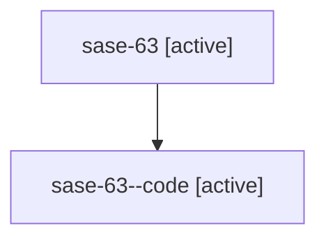

# Family: sase-63

Owner: `bbugyi200.athena` · Hood: `sase-63` · Members: 2

## Lineage

The diagram is an optional enhancement; the ordered table below contains the same lineage in accessible text.

| Role | Agent | State | Model / provider | Timing | Commits | Prompt | Chat |
|---|---|---|---|---|---:|---|---|
| root | sase-63 | active | gpt-5.6-sol / codex | 2026-07-15T14:27:30.881738+00:00 | 0 | [Prompt](../agents/bbugyi200.athena.sase-63/prompt.md) | [Chat](../agents/bbugyi200.athena.sase-63/chat.md) |
| code | sase-63--code | active | gpt-5.6-sol / codex | 2026-07-15T14:32:12.145828+00:00 | 0 | — | — |
