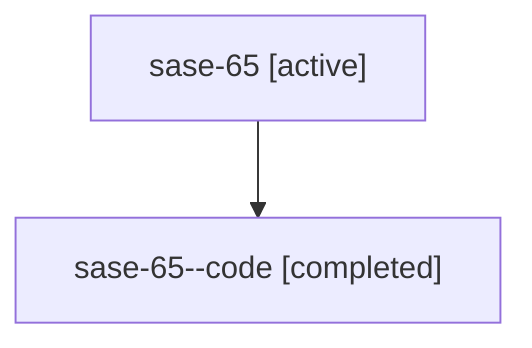

# Family: sase-65

[Agent Hoods](../README.md) / [bbugyi200](../users/bbugyi200/README.md) / [athena](../users/bbugyi200/machines/athena/README.md) / [sase-65](../users/bbugyi200/machines/athena/hoods/sase-65/README.md) / sase-65

Owner: `bbugyi200.athena` · Hood: `sase-65` · Members: 2

## Lineage

The diagram is an optional enhancement; the ordered table below contains the same lineage in accessible text.

| Role | Agent | State | Model / provider | Timing | Commits | Prompt | Chat |
|---|---|---|---|---|---:|---|---|
| root | sase-65 | active | claude-fable-5 / claude | 2026-07-16T01:06:20.662952+00:00 | [1](../agents/bbugyi200.athena.sase-65/README.md#commits) | [Prompt](../agents/bbugyi200.athena.sase-65/prompt.md) | [Chat](../agents/bbugyi200.athena.sase-65/chat.md) |
| code | sase-65--code | completed | gpt-5.6-sol / codex | 2026-07-16T01:29:57.149647+00:00 | 0 | — | [Chat](../agents/bbugyi200.athena.sase-65--code/chat.md) |

## Commits

| Role | Repo | Commit | Subject | Committed (UTC) |
|---|---|---|---|---|
| root | sase | [`26682ba`](https://github.com/sase-org/sase/commit/26682ba376d8eaaf426e532ef6a895815da25824) | test: pin visual snapshot rendering environment (sase-65) | 2026-07-16 01:58:06 |

## Neighbors

| Agent | Relation | State |
|---|---|---|
| [sase-65.1](../agents/bbugyi200.athena.sase-65.1/README.md) | descendant | active |
| [sase-65.2](../agents/bbugyi200.athena.sase-65.2/README.md) | descendant | active |
| [sase-65.3](../agents/bbugyi200.athena.sase-65.3/README.md) | descendant | active |
| [sase-65.4](../agents/bbugyi200.athena.sase-65.4/README.md) | descendant | active |
