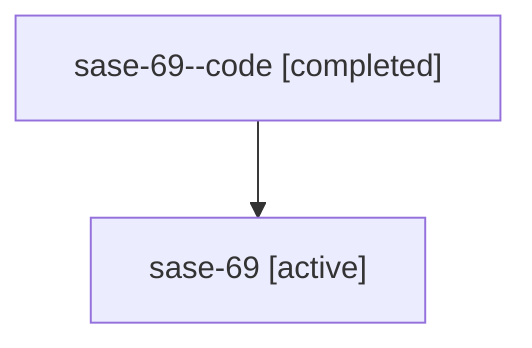

# Family: sase-69

[Agent Hoods](../README.md) / [bbugyi200](../users/bbugyi200/README.md) / [athena](../users/bbugyi200/machines/athena/README.md) / [sase-69](../users/bbugyi200/machines/athena/hoods/sase-69/README.md) / sase-69

Owner: `bbugyi200.athena` · Hood: `sase-69` · Members: 2

## Lineage

The diagram is an optional enhancement; the ordered table below contains the same lineage in accessible text.

| Role | Agent | State | Model / provider | Timing | Commits | Prompt | Chat |
|---|---|---|---|---|---:|---|---|
| code | sase-69--code | completed | gpt-5.6-sol / codex | 2026-07-16T03:14:27.600366+00:00 | [1](../agents/bbugyi200.athena.sase-69--code/README.md#commits) | — | [Chat](../agents/bbugyi200.athena.sase-69--code/chat.md) |
| root | sase-69 | active | claude-fable-5 / claude | 2026-07-16T03:03:27.492208+00:00 | [1](../agents/bbugyi200.athena.sase-69/README.md#commits) | [Prompt](../agents/bbugyi200.athena.sase-69/prompt.md) | [Chat](../agents/bbugyi200.athena.sase-69/chat.md) |

## Commits

| Role | Commit | Subject | Committed (UTC) |
|---|---|---|---|
| code | [`54f75ab`](https://github.com/sase-org/sase/commit/54f75ab41f768e8223b80d778169e1aea8513c88) | feat(ace): make commits actions configurable (sase-69) | 2026-07-16 03:41:19 |
| root | [`54f75ab`](https://github.com/sase-org/sase/commit/54f75ab41f768e8223b80d778169e1aea8513c88) | feat(ace): make commits actions configurable (sase-69) | 2026-07-16 03:41:19 |

## Neighbors

| Agent | Relation | State |
|---|---|---|
| [sase-69.1](../agents/bbugyi200.athena.sase-69.1/README.md) | descendant | active |
| [sase-69.2](../agents/bbugyi200.athena.sase-69.2/README.md) | descendant | active |
| [sase-69.3](../agents/bbugyi200.athena.sase-69.3/README.md) | descendant | active |
| [sase-69.4](../agents/bbugyi200.athena.sase-69.4/README.md) | descendant | active |
| [sase-69.5](../agents/bbugyi200.athena.sase-69.5/README.md) | descendant | active |
| [sase-69.6](../agents/bbugyi200.athena.sase-69.6/README.md) | descendant | active |
| [sase-69.7](../agents/bbugyi200.athena.sase-69.7/README.md) | descendant | active |
