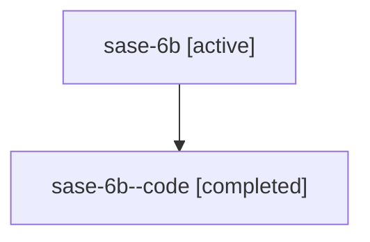

# Family: sase-6b

[Agent Hoods](../README.md) / [bbugyi200](../users/bbugyi200/README.md) / [athena](../users/bbugyi200/machines/athena/README.md) / [sase-6b](../users/bbugyi200/machines/athena/hoods/sase-6b/README.md) / sase-6b

Owner: `bbugyi200.athena` · Hood: `sase-6b` · Members: 2 · Bead: [sase-6b](https://github.com/sase-org/sase--beads/blob/main/pages/sase-6b/README.md)

## Lineage

The diagram is an optional enhancement; the ordered table below contains the same lineage in accessible text.

| Role | Agent | State | Model / provider | Timing | Commits | Prompt | Chat |
|---|---|---|---|---|---:|---|---|
| root | sase-6b | active | gpt-5.6-sol / codex | 2026-07-16T13:36:43.117902+00:00 | 0 | [Prompt](../agents/bbugyi200.athena.sase-6b/prompt.md) | [Chat](../agents/bbugyi200.athena.sase-6b/chat.md) |
| code | sase-6b--code | completed | gpt-5.6-sol / codex | 2026-07-16T13:51:31.193841+00:00 | [1](../agents/bbugyi200.athena.sase-6b--code/README.md#commits) | — | [Chat](../agents/bbugyi200.athena.sase-6b--code/chat.md) |

## Commits

| Role | Repo | Commit | Subject | Committed |
|---|---|---|---|---|
| code | sase | [`9292e5b`](https://github.com/sase-org/sase/commit/9292e5bf38eb93e9b7d2ae80316400d04bf52bae) | build(deps): require sase-core-rs 0.5.0 (sase-6b) | 2026-07-16 10:16:56 EDT |

## Neighbors

| Agent | Relation | State |
|---|---|---|
| [sase-6b.1](../agents/bbugyi200.athena.sase-6b.1/README.md) | descendant | active |
| [sase-6b.2](../agents/bbugyi200.athena.sase-6b.2/README.md) | descendant | active |
| [sase-6b.3](../agents/bbugyi200.athena.sase-6b.3/README.md) | descendant | active |
