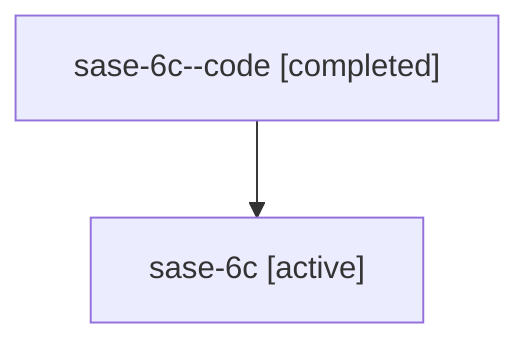

# Family: sase-6c

[Agent Hoods](../README.md) / [bbugyi200](../users/bbugyi200/README.md) / [athena](../users/bbugyi200/machines/athena/README.md) / [sase-6c](../users/bbugyi200/machines/athena/hoods/sase-6c/README.md) / sase-6c

Owner: `bbugyi200.athena` · Hood: `sase-6c` · Members: 2

## Lineage

The diagram is an optional enhancement; the ordered table below contains the same lineage in accessible text.

| Role | Agent | State | Model / provider | Timing | Commits | Prompt | Chat |
|---|---|---|---|---|---:|---|---|
| code | sase-6c--code | completed | gpt-5.6-sol / codex | 2026-07-16T16:10:54.871301+00:00 | [1](../agents/bbugyi200.athena.sase-6c--code/README.md#commits) | — | [Chat](../agents/bbugyi200.athena.sase-6c--code/chat.md) |
| root | sase-6c | active | gpt-5.6-sol / codex | 2026-07-16T15:56:33.711592+00:00 | 0 | [Prompt](../agents/bbugyi200.athena.sase-6c/prompt.md) | [Chat](../agents/bbugyi200.athena.sase-6c/chat.md) |

## Commits

| Role | Repo | Commit | Subject | Committed |
|---|---|---|---|---|
| code | sase | [`b8b7d65`](https://github.com/sase-org/sase/commit/b8b7d65e1a0bb39a59ec2385416b9c8cbf5400f6) | perf(tui): keep remaining maintenance off the message pump (sase-6c) | 2026-07-16 12:22:59 EDT |

## Neighbors

| Agent | Relation | State |
|---|---|---|
| [sase-6c.1](../agents/bbugyi200.athena.sase-6c.1/README.md) | descendant | active |
| [sase-6c.2](../agents/bbugyi200.athena.sase-6c.2/README.md) | descendant | active |
| [sase-6c.3](../agents/bbugyi200.athena.sase-6c.3/README.md) | descendant | active |
| [sase-6c.4](../agents/bbugyi200.athena.sase-6c.4/README.md) | descendant | active |
| [sase-6c.5](../agents/bbugyi200.athena.sase-6c.5/README.md) | descendant | active |
