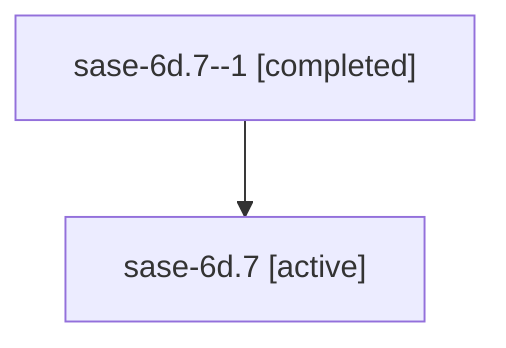

# Family: sase-6d.7

[Agent Hoods](../README.md) / [bbugyi200](../users/bbugyi200/README.md) / [athena](../users/bbugyi200/machines/athena/README.md) / [sase-6d](../users/bbugyi200/machines/athena/hoods/sase-6d/README.md) / sase-6d.7

Owner: `bbugyi200.athena` · Hood: `sase-6d` · Members: 2

## Lineage

The diagram is an optional enhancement; the ordered table below contains the same lineage in accessible text.

| Role | Agent | State | Model / provider | Timing | Commits | Prompt | Chat |
|---|---|---|---|---|---:|---|---|
| 1 | sase-6d.7--1 | completed | gpt-5.6-sol / codex | 2026-07-16T18:48:27.516286+00:00 | 0 | — | [Chat](../agents/bbugyi200.athena.sase-6d.7--1/chat.md) |
| root | sase-6d.7 | active | gpt-5.6-sol / codex | 2026-07-16T18:28:25.531414+00:00 | [1](../agents/bbugyi200.athena.sase-6d.7/README.md#commits) | [Prompt](../agents/bbugyi200.athena.sase-6d.7/prompt.md) | [Chat](../agents/bbugyi200.athena.sase-6d.7/chat.md) |

## Commits

| Role | Commit | Subject | Committed (UTC) |
|---|---|---|---|
| root | [`0bf8eb0`](https://github.com/sase-org/sase/commit/0bf8eb0d90f85f1ae98f9216766587c88ee6541a) | docs: document canonical SASE content layout (sase-6d.7) | 2026-07-16 19:12:46 |

## Neighbors

| Agent | Relation | State |
|---|---|---|
| [sase-6d](bbugyi200.athena.sase-6d.md) (family · 2) | ancestor | active 1, completed 1 |
| [sase-6d.1](../agents/bbugyi200.athena.sase-6d.1/README.md) | sase-6d hood | active |
| [sase-6d.2](../agents/bbugyi200.athena.sase-6d.2/README.md) | sase-6d hood | active |
| [sase-6d.3](../agents/bbugyi200.athena.sase-6d.3/README.md) | sase-6d hood | active |
| [sase-6d.4](../agents/bbugyi200.athena.sase-6d.4/README.md) | sase-6d hood | active |
| [sase-6d.5](../agents/bbugyi200.athena.sase-6d.5/README.md) | sase-6d hood | active |
| [sase-6d.6](../agents/bbugyi200.athena.sase-6d.6/README.md) | sase-6d hood | active |
| [sase-6d.8](../agents/bbugyi200.athena.sase-6d.8/README.md) | sase-6d hood | active |
| [sase-6d.8.f0](../agents/bbugyi200.athena.sase-6d.8.f0/README.md) | sase-6d hood | active |
| [sase-6d.9](../agents/bbugyi200.athena.sase-6d.9/README.md) | sase-6d hood | active |
