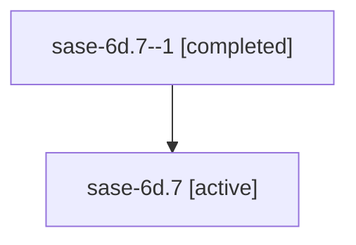

# Family: sase-6d.7

Owner: `bbugyi200.athena` · Hood: `sase-6d` · Members: 2

## Lineage

The diagram is an optional enhancement; the ordered table below contains the same lineage in accessible text.

| Role | Agent | State | Model / provider | Timing | Commits | Prompt | Chat |
|---|---|---|---|---|---:|---|---|
| 1 | sase-6d.7--1 | completed | gpt-5.6-sol / codex | 2026-07-16T18:48:27.516286+00:00 | 1 | — | [Chat](../agents/bbugyi200.athena.sase-6d.7--1/chat.md) |
| root | sase-6d.7 | active | gpt-5.6-sol / codex | 2026-07-16T18:28:25.531414+00:00 | 1 | [Prompt](../agents/bbugyi200.athena.sase-6d.7/prompt.md) | [Chat](../agents/bbugyi200.athena.sase-6d.7/chat.md) |
